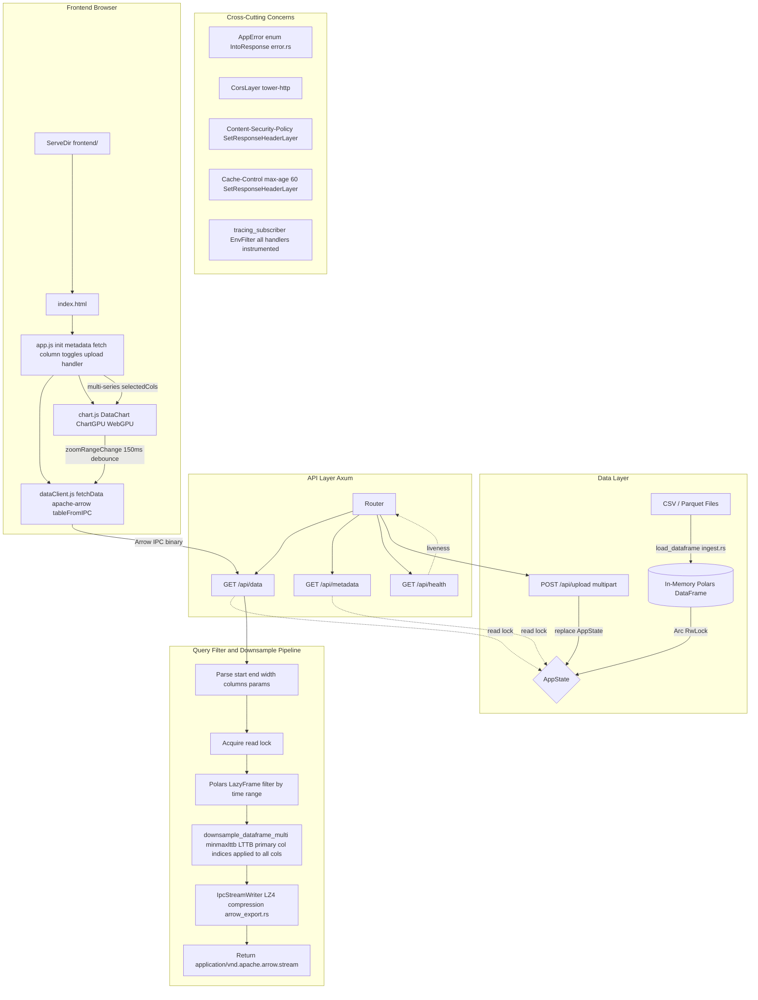

# Copilot Instructions for edatime

This project is a high-performance time-series exploratory data analysis (EDA) tool built primarily with Rust (Axum, Polars) on the backend and plain JavaScript with WebGL (`chartgpu`) on the frontend. The communication between them relies upon the Apache Arrow IPC format.

## Core Architecture & Stack
- **Backend:** Rust, Axum, Polars, Arrow IPC, minmaxlttb (downsampling).
- **Frontend:** Vanilla JS (`frontend/js/*.js`), HTML, CSS, `chartgpu` (WebGL rendering, injected or bundled via npm).

## Guidelines for Code Contributions

### 1. Backend (Rust)
- **Error Handling:** Use `tracing` for structured logging rather than `println!`. Propagate specific error enums (often located in `src/error.rs`) and avoid `unwrap()` or `expect()` in production paths. Handlers should generally return a custom `Result<impl IntoResponse, AppError>`.
- **Data Serialization:** For frontend consumption, always format time series data to Apache Arrow IPC format (`arrow_export.rs`) instead of standard JSON whenever possible, ensuring zero-copy read on the client.
- **Async & Threading:** Follow Tokio idioms. When executing heavy CPU-bound tasks like Polars parsing, downsampling, or large I/O, explicitly run them inside `tokio::task::block_in_place()` or `spawn_blocking()` to prevent starving the Axum async scheduler.
- **State Management:** Mutating the main `AppState` generally involves `tokio::sync::RwLock` wraping a Polars `DataFrame`. Be careful with read/write locks, try holding read locks for the shortest time possible, and write locks only during ingestion.

### 2. Frontend (JavaScript/HTML/CSS)
- **Simplicity:** Keep the frontend free of heavy frameworks (e.g., React, Vue) unless absolutely necessary. We stick to vanilla JavaScript to maintain low overhead and high performance.
- **Data Flow:** Data fetching is handled by `dataClient.js` using `fetch` or WebSockets and interpreting the ArrayBuffers into typed arrays via `apache-arrow`. Passed typed arrays directly to `chartgpu` context to avoid GC overhead.
- **Performance:** For updating charts on zoom/pan, throttle or debounce heavy re-fetch requests based on chart events (`chart.js`).
- **Styling:** Use plain CSS (`frontend/css/style.css`).

### 3. General Practices
- Build on top of existing abstractions (like `downsample.rs`).
- Any new Axum endpoints should be correctly documented in the router scope inside `src/main.rs` and their module inside `src/routes/`.
- Ensure new or modified endpoints handle CORS and caching strategies as implemented in the root `Router` middleware.


# Goal

Build a timeseries analytics web app.

Backend: Rust + Polars + tokio + axum (with the `minmaxlttb` crate for pre-downsampling)
Protocol: Apache Arrow IPC (Binary)
Frontend: ChartGPU

Workflow:

3. The Interactive Data Flow (Cactus Architecture)

Since you want the app to be interactive, use a Request-Response loop between the ChartGPU frontend and the Rust/Polars RAM store. Example:
    Frontend (ChartGPU): User zooms into a 1-hour window.

    Frontend: Sends a request: GET /data?start=T1&end=T2&width=2000px.

    Rust Backend: * Filter: df.lazy().filter(col("ts").gt(T1).and(col("ts").lt(T2))) (Instant in Polars).

        Downsample: Use `minmaxlttb` crate to reduce the filtered result to ~4,000 points.

        Binary Stream: Send the 4,000 points as an Apache Arrow IPC stream (Avoid JSON!).

    Frontend: Receives Arrow IPC binary data → ChartGPU renders via WebGPU.

Transport to frontend exclusively via Apache Arrow IPC — fast and lightweight.


The goal would also be to add different chart types in version 2.


# Implementation Plan

## Phase 1: Project Scaffolding & Backend Foundation

### 1.1 — Cargo Dependencies & Project Structure
- Add dependencies to `Cargo.toml`: `axum`, `tokio` (full features), `polars` (with lazy, temporal, io features), `arrow` / `arrow-ipc`, `minmaxlttb`, `serde`, `tower-http` (cors, static files), `tracing`, `tracing-subscriber`.
- Create module structure:
  ```
  src/
    main.rs          — Tokio entrypoint, Axum router setup
    state.rs          — AppState: holds the in-memory Polars DataFrame(s)
    ingest.rs         — CSV / Parquet file loading into Polars DataFrames
    routes/
      mod.rs
      data.rs         — GET /api/data  (query, filter, downsample, Arrow IPC response)
      metadata.rs     — GET /api/metadata  (column names, time range, row count)
    downsample.rs     — Wrapper around `minmaxlttb` crate for downsampling
    arrow_export.rs   — Polars DataFrame → Arrow IPC binary stream serialization
  ```

### 1.2 — In-Memory Data Store (AppState)
- Define `AppState` holding an `Arc<RwLock<DataFrame>>` so it can be shared across Axum handlers.
- On startup, load a sample timeseries CSV/Parquet into the DataFrame.
- Ensure the timestamp column is parsed as `Datetime` dtype in Polars.

### 1.3 — Data Ingestion Endpoint (stretch — Phase 1 keeps it file-based)
- `ingest.rs`: function `load_dataframe(path: &str) -> Result<DataFrame>` using `CsvReader` or `ParquetReader`.
- Validate that the loaded frame contains at least one datetime column and one numeric column.
- Allow scanning the parquet file for only partial ingest

---

## Phase 2: Query, Filter & Downsample Pipeline

### 2.1 — Query Endpoint: `GET /api/data`
- Query parameters: `start` (ISO-8601), `end` (ISO-8601), `width` (pixel width of the chart viewport), `columns` (optional comma-separated list of value columns).
- Handler flow:
  1. Parse params → `NaiveDateTime` / `DateTime<Utc>`.
  2. Acquire read lock on `AppState`.
  3. Build a Polars **lazy** query:
     ```rust
     df.clone().lazy()
       .filter(col("ts").gt_eq(lit(start)).and(col("ts").lt_eq(lit(end))))
       .select([col("ts"), col(value_col)])
       .collect()?
     ```
  4. Pass the filtered DataFrame to the downsampler.
  5. Serialize the downsampled result to Arrow IPC bytes.
  6. Return with `Content-Type: application/vnd.apache.arrow.stream`.

### 2.2 — LTTB Downsampling via `minmaxlttb` (`downsample.rs`)
- Use the `minmaxlttb` crate — do NOT implement LTTB from scratch.
- Wrap the crate's API: extract columns as slices, call `minmaxlttb` with `target_points`, collect the selected indices.
- `target_points` is derived from `width * 2` (2× oversampling for crisp rendering).
- If the filtered data has fewer points than `target_points`, skip downsampling entirely.
- Return a new `DataFrame` containing only the selected rows.

### 2.3 — Arrow IPC Serialization (`arrow_export.rs`)
- Convert the Polars `DataFrame` to a RecordBatch via `df.to_arrow()`.
- Write to an in-memory `Vec<u8>` using `arrow::ipc::writer::StreamWriter`.
- Return the bytes to the handler for the response body.

---

## Phase 3: Metadata & Health Endpoints

### 3.1 — `GET /api/metadata`
- Returns JSON with: column names & dtypes, total row count, min/max timestamp, list of numeric columns available for charting.
- Frontend uses this on load to configure the chart and time-range picker.

### 3.2 — `GET /api/health`
- Simple liveness check returning 200 OK with `{"status": "ok"}`.

---

## Phase 4: Frontend — ChartGPU + Arrow Deserialization

### 4.1 — Static File Serving & HTML Shell
- Serve static files from `frontend/` directory via `tower-http::services::ServeDir`.
- Create:
  ```
  frontend/
    index.html        — App shell, loads ChartGPU and JS modules
    js/
      app.js          — Initialization, fetch metadata, setup ChartGPU chart
      dataClient.js   — Fetch binary Arrow IPC data, deserialize with apache-arrow JS
      chart.js        — ChartGPU instance management, bindDataReactive
    css/
      style.css       — Minimal layout styling
  ```

### 4.2 — Arrow IPC Deserialization in Browser
- Use the `apache-arrow` npm package (loaded via CDN/ESM) to read the binary Arrow IPC stream response.
- Convert Arrow Table columns to typed arrays (`Float64Array`, `BigInt64Array` for timestamps).
- Feed typed arrays directly into ChartGPU for WebGPU-accelerated rendering.

### 4.3 — ChartGPU Line Chart (Default View)
- Initialize a ChartGPU instance targeting a `<canvas>` element; ChartGPU renders natively via WebGPU.
- Configure a time-axis and value axis.
- On initial load: fetch metadata → set time range → fetch data for the full range → render.

### 4.4 — Interactive Zoom → Re-fetch Loop (Cactus Architecture Core)
- Listen to ChartGPU zoom/pan events.
- On zoom/pan, debounce (150ms), then:
  1. Read the new visible `start` / `end` timestamps from the zoom state.
  2. Read the chart container's pixel width.
  3. `GET /api/data?start=...&end=...&width=...`
  4. Deserialize Arrow IPC response → update ChartGPU data.
- This keeps the point count bounded (~2×width) regardless of zoom level.

### 4.5 — WebGPU Rendering (ChartGPU)
- ChartGPU uses WebGPU natively — no fallback layer or feature flags needed.
- Typed arrays from Arrow deserialization are uploaded directly to GPU vertex/storage buffers by ChartGPU.
- Verify WebGPU adapter availability on page load; display a clear error if the browser lacks WebGPU support.

---

## Phase 5: Data Upload & Multi-Series Support

### 5.1 — File Upload Endpoint: `POST /api/upload`
- Accept `multipart/form-data` with a CSV or Parquet file.
- Parse into a Polars DataFrame, validate schema (datetime + numerics).
- Replace / append to the in-memory store; update `AppState`.

### 5.2 — Multi-Column / Multi-Series Charting
- Allow `columns` query param on `/api/data` to request multiple value columns.
- Frontend renders each column as a separate ChartGPU series on the same time axis.
- Metadata endpoint returns the list of available columns so the UI can present toggles.

---

## Phase 6: Polish, Error Handling & Performance

### 6.1 — Error Handling
- Define a unified `AppError` enum implementing `IntoResponse` for Axum.
- Map Polars errors, parse errors, and IO errors into appropriate HTTP status codes + JSON error bodies.

### 6.2 — CORS & Security
- Configure `tower-http::cors` to allow the frontend origin in dev; restrict in prod.
- Add `Content-Security-Policy` headers for the HTML shell.

### 6.3 — Logging & Observability
- Initialize `tracing_subscriber` with `fmt` + `EnvFilter`.
- Add `tracing::instrument` to all route handlers.
- Log query parameters, filtered row counts, downsample ratios, response sizes.

### 6.4 — Performance Tuning
- Benchmark `minmaxlttb` on 10M+ row datasets; profile for bottlenecks.
- Profile Arrow IPC serialization; evaluate `LZ4` frame compression for large payloads.
- Add `Cache-Control` headers for immutable historical data ranges.

---

## Phase 7 (v2): Additional Chart Types & Features
- Bar charts, scatter plots, heatmaps via ChartGPU (as supported) or companion library.
- Aggregation endpoints (sum, mean, min, max per bucket) for bar/histogram views.
- Annotation / marker support (user-defined events overlaid on timeseries).
- Dashboard mode: multiple chart panels with synchronized time axes.
- Persistent storage: optional SQLite or DuckDB backend behind Polars for datasets that exceed RAM.

---

## Task Dependency Graph (Summary)

```
Phase 1 ──► Phase 2 ──► Phase 3
                │               │
                ▼               ▼
             Phase 4 ──► Phase 5 ──► Phase 6 ──► Phase 7
```

Phases 1-3 (backend) and Phase 4 (frontend) can be developed in parallel once the `/api/data` contract (Arrow IPC over HTTP) is agreed upon.

# Currently Implemented Architecture

Phases 1–6 are implemented. Phase 7 (v2 chart types & dashboard) is not yet started.
The only gap within implemented phases is **Phase 4.5**: ChartGPU itself initialises WebGPU
internally, but `app.js` does not yet show an explicit user-facing error if the browser lacks
WebGPU support.



**Phase 1** – Project scaffolding complete. Full module structure under `src/`, all Cargo
dependencies present, `AppState` with `Arc<RwLock<DataFrame>>`, `sample.csv` auto-loaded on
startup via `ingest.rs`. Both CSV and Parquet supported; timestamp column auto-renamed to `ts`
and sorted for LTTB.

**Phase 2** – Query / filter / downsample pipeline complete. `/api/data` applies a Polars lazy
time-range filter, passes the result to `downsample_dataframe_multi` (MinMaxLTTB, `target_points
= width × 2`, skipped when data ≤ target), serialises via `IpcStreamWriter` with LZ4 compression,
and returns `application/vnd.apache.arrow.stream`.

**Phase 3** – Metadata and health endpoints complete. `/api/metadata` returns column names,
dtypes, numeric columns, total row count, and `min`/`max` timestamp. `/api/health` returns
`{"status":"ok"}`.

**Phase 4** – Frontend complete. Static files served by `ServeDir`. `dataClient.js` deserialises
Arrow IPC via the `apache-arrow` ESM CDN import. `chart.js` manages a ChartGPU instance with
time and value axes. `app.js` fetches metadata on load, builds column toggles, performs the
initial full-range render, and re-fetches on every debounced `zoomRangeChange` event. On page
load, `checkWebGPU()` calls `navigator.gpu.requestAdapter()`; if the browser lacks WebGPU
support or no adapter is found, a clear error message is rendered inside the chart container
before any other initialisation proceeds.

**Phase 5** – Upload and multi-series complete. `POST /api/upload` accepts `multipart/form-data`
(CSV or Parquet), validates schema, and atomically replaces the in-memory `AppState`. The
`columns` query parameter on `/api/data` accepts a comma-separated list; `downsample_dataframe_multi`
preserves all requested columns by applying LTTB indices from the primary column. Frontend renders
each column as a separate ChartGPU series with independent colour assignment.

**Phase 6** – Polish, error handling and performance complete. `AppError` enum maps Polars, IO,
parse, and bad-request errors to appropriate HTTP status codes with JSON bodies. CORS is open in
dev via `CorsLayer::new().allow_origin(Any)`. CSP and `Cache-Control` headers are injected via
`SetResponseHeaderLayer`. All route handlers are instrumented with `#[tracing::instrument]`;
`tracing_subscriber` uses `EnvFilter`. LZ4 compression is applied at serialisation time.
`benches_minmax.rs` binary exists for MinMaxLTTB performance profiling.

# Learnings
- **Polars v0.53 API Changes:** `LazyFrame::scan_parquet` requires paths mapped into `PlRefPath` (e.g. `.into()`). For CSVs, `LazyCsvReader` is preferred over the older `CsvReadOptions` pattern and enables builder methods like `.with_try_parse_dates(true)`.
- **MinMaxLTTB integration:** Needs simple parsing mapping floats towards an iteratable `Option<f64>` zip map yielding `minmaxlttb::Point` values.
- **Apache Arrow IPC Integration:** Using `IpcStreamWriter` instead of calling Apache's internal memory chunks reduces typing overhead explicitly if the target `SerWriter` streams inside an unstructured `Vec<u8>`.
- **Frontend zoom debugging:** Enable verbose logging via `/?debug=1` (or `localStorage.edatimeDebug=1`) to trace: drag selection → computed timestamps → `/api/data` request → Arrow decode → chart update.
- **ChartGPU internal zoomRange:** ChartGPU maintains an internal percent-space zoom state. Even if zoom is managed by refetching timestamp windows, a stale `zoomRange` can clip rendering and look like "no data"; resetting it to `(0..100)` after data updates prevents this.
- **ChartGPU crosshair X values:** `crosshairMove` / `click` payloads may report X as an offset from the current x-axis minimum (e.g. `3_600_000` for +1 hour), so convert to absolute epoch-ms using the current x-domain when displaying timestamps.


