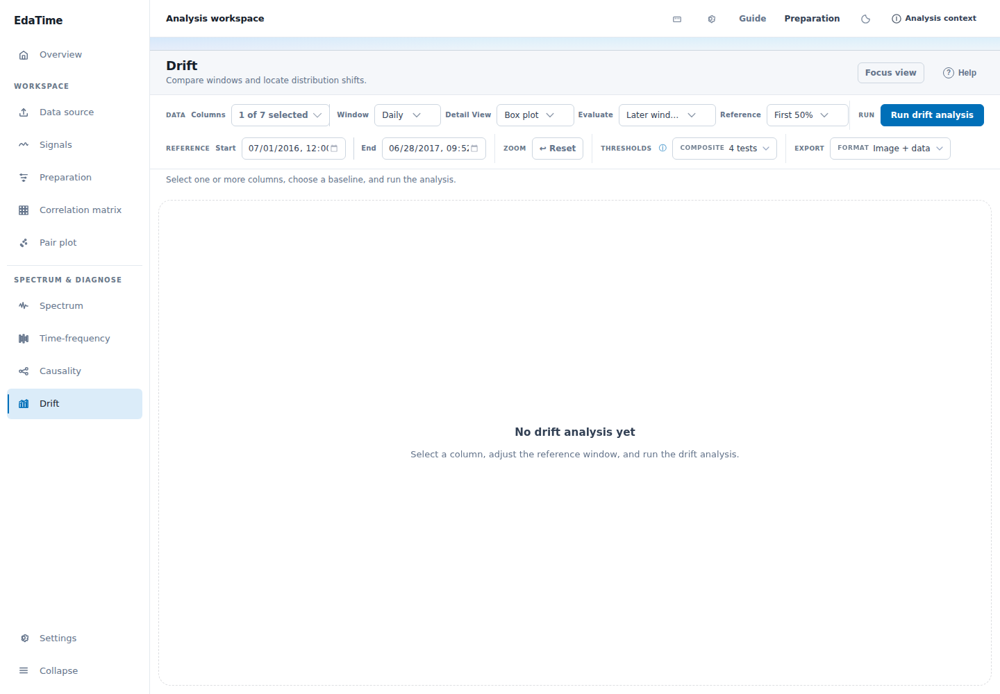
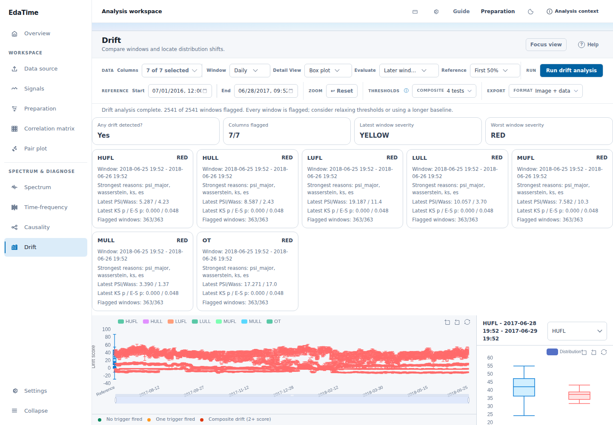
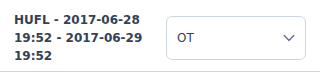

# Drift page product audit

Audit date: 2026-08-04

## Scope

- Live local page at a 1440 × 1000 desktop viewport
- Loaded dataset with seven numeric traces
- Daily windows, first 50% baseline, all later windows
- Decision flow: configure analysis → decide dataset drift → inspect one trace

## Overall verdict

The page has the right analytical ingredients, but it is not yet reliable enough for the stated decision. It answers the binary question (“Any drift detected? Yes”), but it does not produce a coherent answer to “how bad is it?” The live result says every trace’s latest state is red while the global latest severity is yellow. The single-trace selector and window sorting controls also fail to update the content they claim to control.

## Evidence

### Step 1 — Configure and run: needs focus

The baseline and window settings are visible, and the run action is clear. However, seven concepts have equal visual weight before the result exists: columns, window, plot style, evaluation mode, baseline preset, dates, thresholds, zoom, and export. The default is one selected trace, which works against the primary whole-dataset use case.

### Step 2 — Decide whether the dataset drifted: mixed

The result immediately states that drift exists and that 7/7 traces are flagged. The persistent 2541/2541-window warning is useful. The severity story is inconsistent, though: all trace cards show RED while “Latest window severity” says YELLOW. The timeline is also too dense to reveal which traces or periods contribute most.

### Step 3 — Inspect a trace: broken

The trace selector shows OT, but the detail title and content remain HUFL. Choosing “Time: newest first” also leaves Day 1 at the top. The window list has only a sliver of usable height in the 1000px viewport, so hundreds of windows overflow the intended detail area.

## Strengths

- Clear run action and explicit baseline dates.
- Composite verdict exposes the tests that fired instead of hiding the logic.
- Dataset summary, timeline, distribution comparison, and per-window statistics are the right conceptual layers.
- Completeness, sample count, and low-sample information are available for interpreting unreliable results.
- Text labels accompany the green/yellow/red legend.

## Highest-impact changes

### P0 — Make the result correct and internally consistent

1. Do not downgrade a computed RED latest severity to YELLOW because many traces are flagged. Report the actual aggregate severity, then show a separate warning such as “All traces are flagged; thresholds or baseline may not be discriminating.”
2. Fix state wiring for the trace and sort dropdowns. The selected trace must update the title, plot, metrics, and window list as one atomic state change. The selected sort must update the underlying sort mode before rerendering.
3. Add browser-level tests for custom dropdown changes. Assert the visible selector value, detail title, plotted column, selected window, statistics, and first sorted row together.

### P1 — Organize the page around two decisions

4. Make “Dataset overview” and “Trace detail” explicit modes or tabs. Default to Dataset overview.
5. Lead the dataset view with one plain-language conclusion: for example, “Severe, widespread, persistent drift — 7/7 traces affected, 100% of comparison windows flagged, first detected on …”. Keep calibration/data-quality warnings separate from severity.
6. Replace the overlapping multi-series timeline with a trace × time severity heatmap. Each row is a trace, each column is a window, and cell color shows green/yellow/red. This makes prevalence, persistence, and onset visible at once.
7. Replace the equal-weight trace cards with a ranked table: trace, current severity, worst severity, percent of windows flagged, normalized drift score, first change, and primary reason. Clicking a row should open Trace detail.
8. Give Trace detail the full content width or a dedicated lower panel. The current 320px rail cannot comfortably fit a distribution chart, 12 metrics, sorting, and hundreds of windows.
9. Default trace detail to the latest window. Offer quick filters for Latest, Worst, First change, and Flagged only. A 363-row list should be filtered or virtualized, not presented as the primary navigation.

### P2 — Reduce interpretation effort

10. Keep only scope, window, baseline, and Run in the primary setup row. Put plot style, export, and thresholds under Advanced/Decision rules; zoom belongs with the chart.
11. Use “Baseline” and “Comparison period” consistently. Explain that p-values indicate evidence, not magnitude; prioritize standardized effect size and practical severity in summaries.
12. Use status icons, labels, and distinct typography as well as color. Apply the semantic severity styles consistently to summary and trace states.

## Accessibility risks

- The charts expose generic image labels but not the result data or current selection. Provide an adjacent accessible table/summary and update the chart description when selection changes.
- The trace chips are visually about 26px tall, below a comfortable touch target.
- Several labels and metrics use very small text, which risks poor readability at zoom or on lower-density displays.
- Hundreds of listbox options create a long reading and keyboard-navigation burden; filtering and virtualization are needed.
- The selector/content mismatch creates an especially serious assistive-technology problem because the announced selection does not match the reported data.

## Evidence limits

This was a desktop screenshot and interaction audit. It did not verify mobile reflow, 200% zoom, contrast ratios, screen-reader output, or a complete keyboard-only path. No console warnings or errors were emitted during the audited flow.
