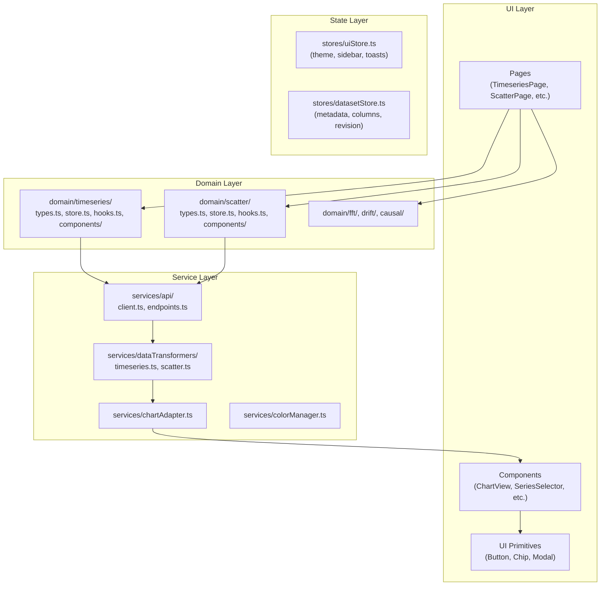
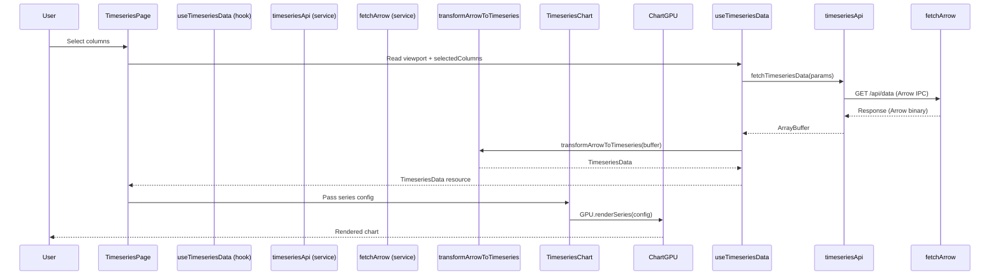
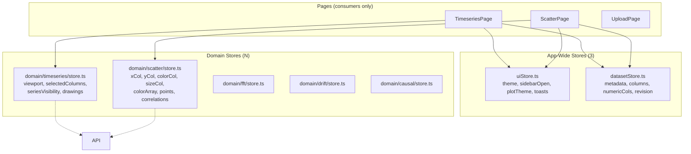
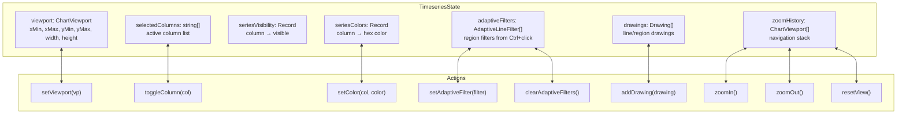

# Frontend Architecture Refactor Plan

**Date**: 2026-05-20  
**Stack**: SolidJS + TypeScript + ChartGPU + Vite  
**Status**: Planned

---

## Table of Contents

1. [Current Architecture Assessment](#1-current-architecture-assessment)
2. [Refactor Goals](#2-refactor-goals)
3. [Proposed Frontend Architecture](#3-proposed-frontend-architecture)
4. [Component & UI Refactor Strategy](#4-component--ui-refactor-strategy)
5. [SolidJS Reactive Architecture](#5-solidjs-reactive-architecture)
6. [ChartGPU Integration Architecture](#6-chartgpu-integration-architecture)
7. [State Management Architecture](#7-state-management-architecture)
8. [Data Fetching & Async Flows](#8-data-fetching--async-flows)
9. [Performance Optimization Plan](#9-performance-optimization-plan)
10. [Developer Experience Improvements](#10-developer-experience-improvements)
11. [Testing Strategy](#11-testing-strategy)
12. [Migration & Incremental Refactor Plan](#12-migration--incremental-refactor-plan)
13. [Patterns, Anti-Patterns & Code Smells Reference](#13-patterns-anti-patterns--code-smells-reference)
14. [Deliverables](#14-deliverables)

---

## 1. Current Architecture Assessment

### 1.1 Store Proliferation (High Severity)

**9 store modules** in `stores/`:
- `analyticsStore.ts` — rolling bands, anomaly detection, correlations
- `fftStore.ts` — FFT-specific state
- `chartStore.ts` — viewport, zoom history, annotations, drawings
- `causalStore.ts` — causal analysis state
- `scatterStore.ts` — scatter config, points, color/size arrays
- `uiStore.ts` — theme, sidebar, toasts, filters, adaptive filters, colors
- `datasetStore.ts` — metadata, columns, revision
- `uploadStore.ts` — upload progress
- `sessionStore.ts`

**Problems**:
- `analyticsStore` duplicates state held in `domain/timeseries/store.ts` (rollingBands, anomalyRegions, correlations)
- `chartStore` viewport is mirrored in `domain/timeseries/store.ts` — two sources of truth
- `scatterStore` has raw arrays (`scatterPoints: [number, number][]`, `colorValues: number[]`) AND domain-wrapped duplicates in `domain/scatter/store.ts`
- `uiStore` conflates presentation state (theme, sidebar, toasts) with domain filters (columnFilters, adaptiveLineFilters) and per-series color customization
- Page components import from multiple stores simultaneously — unclear ownership
- 9 stores is excessive for a mid-sized app

### 1.2 God Components (High Severity)

#### `TimeseriesPage.tsx` (~450 lines)
- Owns **20+ local signals**: drawTool, drawColor, drawWidth, showAnalytics, showLabelsDrawer, chartTitle, xAxisLabel, yAxisLabel, chartEngine, filterModalOpen, filterModalColumn, isLoading, isDownsampled, showSkeleton, colorColumn, showAdaptivePopup, adaptiveFilterPoints, updateChartFn, chartReady, chartInstanceRef, lastContextMenuTime, fetchInProgress
- Manages debounce timers directly (`viewportDebounceTimer`)
- Directly imports `chartStore`, `datasetStore`, `uiStore`, `analyticsStore`
- Directly calls `fetchTimeseriesData`, `buildSeriesConfig`, `fetchRollingBands`, `fetchAnomalies`
- Implements zoom/pan, Ctrl+click adaptive filter, drawing tools, export handlers
- Renders: ChartView, SeriesToolbar, ChartToolbar, ColumnFilterModal, AnalyticsDrawer, LabelsDrawer, AdaptiveFilterPopup

**Smell**: Data fetching, UI state, chart orchestration, and interaction logic all mixed in one file.

#### `ChartView.tsx` (~350+ lines)
- Handles chart lifecycle (useChartEngine, useChartViewport)
- Manages drag state, theme version
- Handles updateChart with visibility filtering, y-range computation, drawing overlays
- Manages keyboard shortcuts, resize observer, animation loop
- Renders CanvasOverlay for drawings/overlays

**Smell**: ChartView is a "chart god" — engine + viewport + overlays + drag + keyboard + resize all in one component.

### 1.3 Chart Lifecycle Fragmentation (Medium-High Severity)

Chart responsibilities are split across:
- `useChartEngine.ts` — engine init, instance management, resize/dispose
- `useChartController.ts` — separate controller (conflated with engine)
- `useChartViewport.ts` — zoom/pan state machine inside `components/chart/`
- `ChartView.tsx` — combines engine + viewport + drag + overlays + keyboard
- `ChartAdapter.ts` interface exists, but `chartEngine.ts` and `ChartGPUAdapter.ts` are not cleanly isolated — ECharts and ChartGPU are mixed at the implementation layer

### 1.4 Hook Layer Confusion (Medium Severity)

- `useTimeseriesData` and `useFilterPipeline` have overlapping concerns
- `useChartEngine` and `useChartController` naming doesn't clarify lifecycle vs operations ownership
- `useOverlayController` referenced in comments but missing from `hooks/`
- `dataFetch.ts` imports stores directly — breaking inversion of control

### 1.5 Service Layer Impurity (Medium Severity)

- `services/api.ts` mixes request deduplication with typed endpoint functions and API types (ColumnMetadata, TimeRange, ColumnProfile, DatasetMetadata)
- `services/dataFetch.ts` mixes data loading, caching, column filtering, and color analysis — has its own `TimeseriesCache` class AND imports `uiStore` and `chartStore` directly
- `transformers/timeseries.ts` and `transformers/scatter.ts` are incomplete stubs (noted in prior plan but never completed)
- Services are NOT purely async — `dataFetch.ts` imports stores

### 1.6 Domain Module Inconsistency (Medium Severity)

- `domain/timeseries/store.ts` exists, mirrors `chartStore` for viewport, adds timeseries state, but also has separate UI signals exported at module level (drawTool, drawColor, etc.)
- `domain/scatter/store.ts` is a thin wrapper around `stores/scatterStore.ts` — no actual state lives in domain/scatter
- `domain/timeseries/components/` has TimeseriesChart, SeriesSelector, ColumnChips, AdaptiveFilterPopup, AnalyticsDrawer, LabelsDrawer, ColumnFilterModal, TimeseriesToolbar — some are domain-specific, but ColumnChips could be a primitive
- No domain/fft, domain/drift, domain/causal modules despite stores for them

### 1.7 Type System Issues (Medium Severity)

- `types/domains.ts` defines discriminated union types but they aren't used consistently
- `types/index.ts` re-exports from domains, creating two type namespaces that can desync
- `domain/timeseries/types.ts` defines `TimeseriesState`, `ZoomHistory`, `Drawing` overlapping with `types/domains.ts` and `stores/chartStore.ts`
- `AdaptiveLineFilter` defined in `types.ts`, `types/domains.ts`, and imported differently across files

### 1.8 Reactive Pattern Issues (Medium Severity)

- `TimeseriesPage` had module-level mutable variables (`chartUpdateFn`, `chartReady`, `chartInstanceRef`) that bypassed reactivity (partially fixed in TimeseriesChart but still present in TimeseriesPage)
- `createEffect` in TimeseriesPage directly mutates `chartInstanceRef = ...` instead of using signals for chart instance
- Multiple `createMemo` chains with overlapping derived values (e.g., `numericCols`, `datetimeCols`, `allTraceColumns`, `traceColumns` all derived from `datasetStore.state`)

### 1.9 Data Flow Smells (Medium Severity)

- `TimeseriesPage` has `fetchAndRender` that directly updates the chart via `updateChartFn()` callback — no clear separation between data fetching and chart updating
- `scatterStore` holds raw arrays that page components mutate directly
- Page components directly call store methods instead of going through domain hooks
- `useFilterPipeline` is defined but not used consistently in TimeseriesPage

### 1.10 Anti-Patterns Found

| Smell | Location | Description |
|-------|----------|-------------|
| God component | TimeseriesPage.tsx | 450 lines, too many concerns |
| God component | ChartView.tsx | 350+ lines, chart lifecycle over-collection |
| Global state sprawl | stores/ (9 stores) | Unclear ownership, duplicated state |
| Effect bypass | TimeseriesPage | Module-level mutable vars before fix |
| Store duplication | analyticsStore ↔ domain/timeseries/store | Rolling/anomaly state in both |
| Viewport duplication | chartStore ↔ domain/timeseries/store | Viewport in both |
| Mixed services | dataFetch.ts | Data fetching + caching + filtering + color analysis |
| Hook confusion | useTimeseriesData + useFilterPipeline | Overlapping responsibilities |
| Type duplication | 3 namespaces: types/, types/domains.ts, domain/*/types.ts | Three type namespaces |
| Incomplete abstraction | ChartAdapter exists but ECharts/ChartGPU mixed | Adapter not fully isolating engine |
| Service impurity | dataFetch.ts imports stores | Breaks dependency inversion |

---

## 2. Refactor Goals

### 2.1 Modular Feature Isolation
Each analytics domain (timeseries, scatter, fft, drift, causal) is a self-contained module with its own types, state, hooks, and components. No cross-domain imports except through a shared kernel.

### 2.2 Reusable Abstractions
- UI primitives in `components/ui/` (no domain logic)
- Chart infrastructure in `components/chart/` (ChartAdapter interface)
- Service layer with pure async functions (no SolidJS imports)
- Shared hooks for common patterns

### 2.3 Predictable Reactive Data Flow
```
User Action → Page (thin) → Domain Store → Service (pure async) → API
```
Derived state via memos, not redundant stores.

### 2.4 Minimal Re-rendering
Fine-grained signals, memoized derived values, lazy loading, virtualized lists.

### 2.5 Scalable Chart Architecture
```
DomainChart → ChartAdapter → ChartGPUAdapter / EChartsAdapter
```
ViewportManager as a state machine, not scattered across components.

### 2.6 Simplified Debugging
Centralized state ownership, pure service functions testable without SolidJS runtime.

### 2.7 Strict Typing Boundaries
- `domain/*/types.ts` = domain types only
- `services/api/types.ts` = API contract types
- `types/` = shared primitives (viewport, filters)

### 2.8 Maintainable Async Workflows
Request deduplication, cancellation via AbortController, retry/backoff. No fetch logic in UI components.

### 2.9 Extensible Plugin Systems
Chart adapter pattern for engine swapping, export service architecture, theme system with CSS custom properties.

### 2.10 Improved Onboarding
Consistent file organization, architectural linting rules, clear ownership.

---

## 3. Proposed Frontend Architecture

### 3.1 Directory Structure

```
frontend/src/
├── app/                          # App bootstrap only
│   ├── App.tsx                   # Root component with router + ErrorBoundary
│   ├── Startup.tsx               # Initial metadata load sequence
│   └── ErrorBoundary.tsx
│
├── pages/                        # Route-level page components (THIN — ~60 lines each)
│   ├── TimeseriesPage.tsx
│   ├── ScatterPage.tsx
│   ├── FftPage.tsx
│   ├── DriftPage.tsx
│   ├── CausalPage.tsx
│   ├── HeatmapPage.tsx
│   ├── UploadPage.tsx
│   ├── SettingsPage.tsx
│   └── HomePage.tsx
│
├── domain/                       # Feature-modular isolation
│   ├── timeseries/
│   │   ├── types.ts              # TimeseriesState, TimeseriesConfig, ChartCallbacks
│   │   ├── store.ts              # Domain store (signals + createStore for complex)
│   │   ├── hooks.ts              # useTimeseriesData, useTimeseriesViewport
│   │   └── components/
│   │       ├── TimeseriesChart.tsx
│   │       ├── SeriesSelector.tsx
│   │       ├── AdaptiveFilterPanel.tsx
│   │       ├── AnalyticsDrawer.tsx
│   │       ├── LabelsDrawer.tsx
│   │       ├── ColumnFilterModal.tsx
│   │       └── TimeseriesToolbar.tsx
│   ├── scatter/
│   │   ├── types.ts
│   │   ├── store.ts              # Only scatter state (no duplicate arrays)
│   │   ├── hooks.ts              # useScatterData, useScatterCorrelations
│   │   └── components/
│   │       ├── ScatterChart.tsx
│   │       ├── CorrelationMatrix.tsx
│   │       ├── DistributionCards.tsx
│   │       ├── ColorLegend.tsx
│   │       └── ColumnSelectors.tsx
│   ├── fft/
│   │   ├── types.ts
│   │   ├── store.ts
│   │   ├── hooks.ts
│   │   └── components/
│   ├── drift/
│   ├── causal/
│   └── upload/
│       ├── types.ts
│       ├── store.ts
│       ├── hooks.ts
│       └── components/
│
├── stores/                       # App-wide state (3 stores max)
│   ├── uiStore.ts               # Theme, sidebar, toasts ONLY
│   ├── datasetStore.ts          # Metadata, revision tracking ONLY
│   └── index.ts
│
├── services/                     # Pure async (NO SolidJS imports)
│   ├── api/
│   │   ├── client.ts            # Base fetch with deduplication
│   │   ├── endpoints.ts         # Typed endpoint functions
│   │   └── types.ts             # API request/response types
│   ├── dataTransformers/
│   │   ├── timeseries.ts        # Arrow → chart-ready series config
│   │   ├── scatter.ts           # Scatter JSON → chart-ready config
│   │   ├── fft.ts
│   │   └── index.ts
│   ├── cache/
│   │   ├── timeseriesCache.ts
│   │   └── scatterCache.ts
│   └── export/
│       ├── chartExporter.ts
│       └── dataExporter.ts
│
├── components/
│   ├── ui/                      # Primitives ONLY
│   │   ├── Button.tsx
│   │   ├── Chip.tsx
│   │   ├── Input.tsx
│   │   ├── Modal.tsx
│   │   ├── Dropdown.tsx
│   │   ├── RangeSlider.tsx
│   │   ├── LoadingOverlay.tsx
│   │   ├── Tooltip.tsx
│   │   ├── Select.tsx
│   │   ├── Tabs.tsx
│   │   ├── Badge.tsx
│   │   ├── SwitchToggle.tsx
│   │   ├── IconButton.tsx
│   │   ├── Skeleton.tsx
│   │   ├── Toast.tsx
│   │   └── index.ts
│   ├── layout/
│   │   ├── AppShell.tsx
│   │   ├── PageContainer.tsx
│   │   └── Toolbar.tsx
│   └── chart/                   # Chart infrastructure ONLY (no domain logic)
│       ├── ChartAdapter.ts
│       ├── ChartGPUAdapter.ts
│       ├── EChartsAdapter.ts
│       ├── ChartRegistry.ts
│       ├── ViewportManager.ts
│       ├── OverlayRenderer.tsx
│       ├── CanvasOverlay.tsx
│       └── useChartViewport.ts
│
├── hooks/                        # Shared reactive primitives
│   ├── useChartEngine.ts
│   ├── useChartController.ts
│   ├── useViewportSync.ts
│   ├── useAbortController.ts
│   ├── useDebouncedEffect.ts
│   ├── usePageShortcuts.ts
│   └── index.ts
│
├── utils/
│   ├── colorScale.ts
│   ├── plotTemplate.ts
│   ├── formatUtils.ts
│   ├── csvGenerators.ts
│   └── debug.ts
│
├── types/
│   ├── domains.ts               # Shared discriminated unions
│   └── index.ts
│
└── styles/
    ├── tokens.css               # CSS custom properties
    └── global.css
```

### 3.2 Ownership Rules

| Layer | Owner | Rules |
|-------|-------|-------|
| `app/` | Core team | Bootstrap only, no feature logic |
| `pages/` | Any dev | Thin, delegate to domain, ~60 lines max |
| `domain/*/` | Feature dev | Owns all state, hooks, components for that domain |
| `stores/` | Core team | App-wide, 3 stores max (ui, dataset, index) |
| `services/` | Core team | Pure async, no SolidJS |
| `components/ui/` | UI lib owner | Primitives only, no domain knowledge |
| `components/chart/` | Visualization owner | Chart infrastructure only |
| `components/layout/` | UI lib owner | Layout patterns |
| `hooks/` | Core team | Cross-cutting reactive logic |
| `types/` | Core team | Shared types, no domain-specific types |

### 3.3 Dependency Direction

```
pages → domain/*/components → domain/*/store → services/api
         ↓
    components/chart → services/export
         ↓
    components/ui (primitives)
         ↓
    stores/ (uiStore, datasetStore only)
```

Pages NEVER import from stores directly (except uiStore/datasetStore). Pages use domain components and domain hooks.

### 3.4 Anti-Patterns to Avoid

1. **God components**: Pages must stay thin (~60 lines). No page should exceed 100 lines.
2. **Store sprawl**: No more than 3 app-level stores. Domain state lives in domain stores.
3. **Service impurity**: Services must not import from stores or hooks.
4. **Chart lifecycle coupling**: ChartView should not own viewport + overlays + drag + keyboard in one file.
5. **Type duplication**: Each type lives in exactly one place.
6. **Abstraction pyramids**: Prefer shallow hierarchies over deep ones (max 3 levels).
7. **Cross-domain imports**: Domain modules do not import each other.
8. **Mutable module-level state**: Use signals, not module-level `let` variables.

---

## 4. Component & UI Refactor Strategy

### 4.1 Page Components → Thin Orchestrators

Each page component:
- Renders layout and domain components
- Reads domain store state via hooks
- Dispatches user actions to domain store
- No direct store imports (use domain hooks instead)
- No data fetching (use domain hooks)
- No chart manipulation (use domain components)

```typescript
// GOOD
const TimeseriesPage: Component = () => {
  const { state, actions } = useTimeseriesDomain();

  return (
    <div class={styles.page}>
      <TimeseriesToolbar {...state.toolbar} onAction={actions.handleToolbarAction} />
      <TimeseriesChart
        viewport={state.viewport}
        series={state.visibleSeries}
        onZoom={actions.handleZoom}
      />
      <SeriesSelector
        columns={state.allColumns}
        selected={state.selectedColumns}
        colors={state.seriesColors}
        onSelect={actions.handleColumnSelect}
        onColorChange={actions.handleColorChange}
      />
    </div>
  );
};

// BAD (current state)
const TimeseriesPage = () => {
  // 450 lines of signals, fetch logic, chart manipulation, event handlers
};
```

### 4.2 Domain Components Own Domain Logic

- `TimeseriesChart` owns chart-domain interaction (zoom, click, adaptive filter triggers)
- `SeriesSelector` owns series selection, color picking, adaptive targeting
- `AnalyticsDrawer` owns rolling + anomaly configuration

### 4.3 UI Primitives Are Dumb

`components/ui/` contains: Button, Chip, Input, Modal, Dropdown, RangeSlider, LoadingOverlay, Tooltip, Select, Tabs, Badge, SwitchToggle, IconButton, Skeleton, Toast.

**Rules**:
- No domain types as props (use primitives: string, number, boolean)
- No store imports
- Styling via CSS classes + CSS custom properties
- Generic enough to be reusable across all domains

### 4.4 Headless / Compound Component Patterns

For complex UI (e.g., ColumnChips):

```typescript
// Compound: ColumnChips wraps Chip + color picker + adaptive target
// Hook: useColumnChipBehavior for logic
function useColumnChipBehavior(column: string) {
  return { isSelected, toggle, setColor };
}
```

### 4.5 Layout Components

- `AppShell.tsx`: Header + sidebar + content
- `PageContainer.tsx`: Consistent page padding
- `Toolbar.tsx`: Shared toolbar slot with consistent actions

### 4.6 Component Design Rules

1. Props interface should be explicit and typed
2. No spreading `...props` to pass through — explicit prop names
3. Components own their local UI state; domain state lives in stores
4. Prefer composition over prop drilling (use slots/children)
5. Loading states managed via domain hooks, not local signals in pages

### 4.7 UI Anti-Patterns to Avoid

| Anti-Pattern | Manifestation | Solution |
|---|---|---|
| God components | TimeseriesPage 450 lines | Extract domain components |
| Prop drilling | Many levels of passing `onAction` | Use context or domain hooks |
| Stateful presentation | Page components with createSignal for domain state | Use domain store |
| Duplicated interaction | Same zoom/pan code in multiple pages | Extract to chart components |
| Styling fragmentation | Inline styles, !important scattered | CSS custom properties + class names |
| Unclear ownership | Which component handles Ctrl+click? | Domain component owns interaction |

---

## 5. SolidJS Reactive Architecture

### 5.1 Primitive Selection Guide

| Primitive | Use When | Avoid When |
|---|---|---|
| `createSignal` | Simple scalar value, local ephemeral state | Complex nested state |
| `createStore` | Complex nested state (benefits from path syntax) | Simple values |
| `createMemo` | Derived computation from other signals/stores | Side effects |
| `createResource` | Async data fetching with loading/error state | Synchronous data |
| `createEffect` | Syncing external systems (DOM, subscriptions) | Computing derived values |
| `createContext` | Dependency injection (theme, router) | Transporting frequently-changing data |

### 5.2 Signals vs Stores

**Signals** (simpler, fine-grained):
- `drawTool`, `drawColor`, `isLoading`, `chartEngine`
- `filterModalOpen`, `colorColumn`

**Stores** (nested, structured):
- `TimeseriesState` with viewport, seriesVisibility, drawings sub-objects
- `ScatterState` with config nested object
- `DatasetState` with metadata, columns

### 5.3 Derived State Patterns

```typescript
// GOOD: createMemo for derived state
const visibleSeries = createMemo(() =>
  state.selectedColumns.filter(c => !state.hiddenColumns.includes(c))
);

// BAD: createEffect for derived state
createEffect(() => {
  const derived = computeSomething(state.a, state.b);
  store.setDerived(derived);
});
```

### 5.4 Reactive Anti-Patterns

| Anti-Pattern | Code | Problem | Fix |
|---|---|---|---|
| Effect-driven state | `createEffect(() => { store.x = computed(); })` | Indirect mutation | `createMemo` |
| Nested reactive traps | `createEffect(() => { createEffect(() => {...}) })` | Memory leaks | Flatten, `createRoot` |
| Broad store dependencies | `createEffect(() => { console.log(store.state); })` | Re-runs on any change | Select specific paths |
| Accidental subscriptions | `const x = store.state.a.b.c` outside memo | Keeps subscriber alive | Use accessor `() => store.state.a.b.c` |
| Mutable shared state | `let chartInstance = null` | Bypasses reactivity | Use signal |
| Derived state duplication | Same computation in two memos | Inconsistent | Extract to single memo |

---

## 6. ChartGPU Integration Architecture

### 6.1 ChartAdapter Interface

```typescript
// components/chart/ChartAdapter.ts
export interface ChartAdapter {
  init(container: HTMLElement, config: ChartConfig): Promise<void>;
  dispose(): void;
  resize(): void;
  updateSeries(series: SeriesConfig[]): void;
  setViewport(xMin: number, xMax: number, yMin?: number, yMax?: number): void;
  addEventHandler(event: ChartEvent, handler: EventHandler): void;
  removeEventHandler(event: ChartEvent, handler: EventHandler): void;
  setOverlays(overlays: OverlayConfig[]): void;
  clearOverlays(): void;
  exportPNG(): Promise<Blob>;
  exportSVG(): Promise<string>;
}

export type ChartEvent = 'zoom' | 'zoomOut' | 'click' | 'ctrlClick' | 'dragStart' | 'dragMove' | 'dragEnd';

export interface SeriesConfig {
  name: string;
  data: [number, number][];
  color: string;
  visible?: boolean;
}
```

### 6.2 Engine Adapters

```typescript
// ChartGPUAdapter — primary engine
export class ChartGPUAdapter implements ChartAdapter { ... }

// EChartsAdapter — fallback
export class EChartsAdapter implements ChartAdapter { ... }
```

### 6.3 ChartRegistry Factory

```typescript
export function createChartAdapter(type: ChartType, options: ChartOptions): ChartAdapter {
  if (type === 'timeseries' && isWebGPUSupported()) {
    return new ChartGPUAdapter(options);
  }
  return new EChartsAdapter(options);
}
```

### 6.4 ViewportManager State Machine

```typescript
// ViewportManager.ts
export interface ViewportState {
  viewport: ChartViewport;
  zoomHistory: ZoomState;
  isAnimating: boolean;
}
// Events: ZOOM_IN, ZOOM_OUT, ZOOM_TO, PAN, RESET
// Actions: update chart adapter, persist to store
```

### 6.5 Chart Lifecycle Responsibility Split

| Responsibility | Component/File |
|---|---|
| Engine init/dispose | `useChartEngine` hook → `ChartAdapter` |
| Viewport state machine | `ViewportManager.ts` → domain store |
| Series data update | `useChartController` hook → `ChartAdapter.updateSeries` |
| Overlay rendering | `OverlayRenderer.tsx` (CanvasOverlay child) |
| Drawing interaction | `CanvasOverlay.tsx` (mouse/touch handlers) |
| Keyboard shortcuts | `usePageShortcuts` hook → dispatches to chart |
| Resize handling | `useChartEngine` via ResizeObserver |

### 6.6 GPU Memory Management
- `dispose()` must be called when chart unmounts
- ResizeObserver must be disconnected on cleanup
- No lingering WebGPU resources after component destroy
- ChartAdapter.dispose() propagates to engine-specific cleanup

### 6.7 Batch Updates

```typescript
let pendingUpdate: SeriesConfig[] | null = null;
let rafId: number | null = null;

function scheduleUpdate(series: SeriesConfig[]) {
  pendingUpdate = series;
  if (rafId === null) {
    rafId = requestAnimationFrame(flushUpdate);
  }
}

function flushUpdate() {
  if (pendingUpdate) {
    gpu.updateSeries(pendingUpdate);
    pendingUpdate = null;
  }
  rafId = null;
}
```

### 6.8 Chart Anti-Patterns

| Anti-Pattern | Manifestation | Fix |
|---|---|---|
| Monolithic chart wrapper | ChartView owns engine + viewport + overlays + drag + keyboard | Split responsibilities |
| Imperative redraw | `chartInstance.update()` without batching | RAF + batch scheduling |
| Leaking GPU resources | No dispose() on unmount | useChartEngine cleanup |
| Unbounded reactive updates | Effect watches entire store | Granular selectors |
| Oversized chart state | ChartStore holds all state including domain | Domain store owns domain state |

---

## 7. State Management Architecture

### 7.1 Target: 3 Stores

```typescript
// stores/uiStore.ts — presentation state only
interface UIState {
  theme: 'dark' | 'light' | 'system';
  colorScale: ColorScaleName;
  sidebarOpen: boolean;
  plotTheme: PlotThemeMode;
  toasts: ToastMessage[];
}
// NO filters, NO series colors, NO adaptive filters — those are domain state

// stores/datasetStore.ts — server metadata only
interface DatasetState {
  metadata: DatasetMetadata | null;
  columns: ColumnProfile[];
  numericCols: string[];
  datetimeCols: string[];
  xAxisColumn: string | null;
  revision: number | null;
}
// NO loading/error — those are ephemeral, use local signals

// Domain stores own all other state:
// domain/timeseries/store.ts → viewport, selectedColumns, seriesVisibility, drawings
// domain/scatter/store.ts → config, points, color/size arrays, correlations
```

### 7.2 State Ownership Rules

1. **No duplicate state**: `analyticsStore.rollingBands` and `domain/timeseries/store.rollingBands` must consolidate to one source
2. **No cross-store mutations**: domain stores don't import from other stores
3. **No store imports in services**: services are pure async
4. **No store imports in UI components**: use domain hooks instead

### 7.3 State Anti-Patterns

| Anti-Pattern | Manifestation | Fix |
|---|---|---|
| Global state sprawl | 9 stores with unclear boundaries | 3 stores + domain stores |
| Duplicated derived state | analyticsStore ↔ domain/scatter store correlations | Single source of truth |
| Context abuse | Giant context provider with all state | Granular contexts |
| Mutation-heavy stores | Direct `store.x = v` outside actions | Action methods only |
| Stateful utilities | Module with `let cache = ...` | Cache class in services/ |

---

## 8. Data Fetching & Async Flows

### 8.1 API Client Architecture

```typescript
// services/api/client.ts — consolidated deduplication
const _inflight = new Map<string, Promise<unknown>>();

export async function getJson<T>(url: string, signal?: AbortSignal): Promise<T> {
  const existing = _inflight.get(url);
  if (existing) return existing as Promise<T>;
  const promise = (async () => {
    const res = await fetch(url, { cache: 'no-store', signal });
    if (!res.ok) throw new Error(`${url} failed (${res.status})`);
    return res.json() as T;
  })();
  _inflight.set(url, promise);
  try { return await promise; }
  finally { _inflight.delete(url); }
}

export async function fetchArrow(url: string, signal?: AbortSignal): Promise<Response> {
  // same deduplication pattern for Arrow IPC
}
```

### 8.2 Data Transformation Pipeline

```typescript
// services/dataTransformers/timeseries.ts — pure, no SolidJS
export function transformArrowToTimeseries(buffer: ArrayBuffer): TimeseriesData {
  const table = tableFromIPC(buffer);
  // ... transform
  return { xValues, series, returnedRows, downsampled };
}

export function buildSeriesConfig(
  xValues: Float64Array,
  series: Record<string, Float64Array>,
  colors: Record<string, string>,
  filters: ColumnFilters,
  colorByColumn: Record<string, Float64Array> | undefined,
  colorColumn: string | null,
  showLines: boolean,
  colorScale: ColorScaleName,
  adaptiveFilters: AdaptiveLineFilter[]
): SeriesConfig[] {
  // ... build chart-ready config
}
```

### 8.3 Async Anti-Patterns

| Anti-Pattern | Manifestation | Fix |
|---|---|---|
| Fetch in UI component | TimeseriesPage calls fetchTimeseriesData directly | Use domain hook |
| Race conditions | No abort on new request | useAbortController |
| Unmanaged subscriptions | createEffect with fetch, no cleanup | onCleanup + abort |
| Duplicated fetch orchestration | dataFetch and api both deduplicate | Single deduplication |
| Stale reactive resources | Resource doesn't cancel on unmount | useResource with signal |

---

## 9. Performance Optimization Plan

### 9.1 SolidJS Rendering Optimization

1. **Fine-grained signals**: Each piece of state as its own signal
2. **Memo boundaries**: createMemo for every derived value
3. **Keyed For**: Always provide `key` prop to `<For>`
4. **Lazy components**: Pages loaded via `lazy(() => import(...))`
5. **Avoid over-subscription**: Don't subscribe to entire stores when only one field needed

### 9.2 ChartGPU Rendering Optimization

1. **RAF batching**: Batch series updates within requestAnimationFrame
2. **Debounced viewport sync**: Debounce zoom/pan to avoid redundant fetches
3. **Streaming**: Use Arrow IPC streaming for large datasets
4. **GPU memory**: Explicit dispose() and cleanup on unmount
5. **Viewport culling**: Only render visible data range

### 9.3 Performance KPIs

| Metric | Target |
|---|---|
| Initial page load | <2s on 3G |
| Chart render (1200 points) | <100ms |
| Zoom interaction | <16ms (60fps) |
| Scatter matrix (20 cols) | <500ms |
| Memory (idle, 1M rows) | <150MB |
| Bundle size (initial) | <200KB gzipped |

### 9.4 Performance Anti-Patterns

| Anti-Pattern | Manifestation | Fix |
|---|---|---|
| Unnecessary reactive subscriptions | createEffect on entire store | Granular selectors |
| Large reactive trees | Deep nested store causing cascade | Flatten state shape |
| Unbounded effects | createEffect without deps | Specify deps |
| Chart rerender storms | Update chart on every filter change | Debounce + batch |

---

## 10. Developer Experience Improvements

### 10.1 TypeScript Strictness

```json
{
  "compilerOptions": {
    "strict": true,
    "noUncheckedIndexedAccess": true,
    "exactOptionalPropertyTypes": true,
    "noImplicitReturns": true,
    "noFallthroughCasesInSwitch": true,
    "noImplicitOverride": true
  }
}
```

**Key settings explained**:
- `strict: true` enables all strict type-checking options
- `noUncheckedIndexedAccess` prevents silent `undefined` from array/object index access
- `exactOptionalPropertyTypes` distinguishes `optional?: T` from `optional: T | undefined`
- `noImplicitOverride` ensures `override` keyword is used when overriding inherited members
- `noUncheckedIndexedAccess` combined with `exactOptionalPropertyTypes` forces explicit handling of nullable values

### 10.2 Path Aliases

```json
{
  "compilerOptions": {
    "paths": {
      "@/*": ["./src/*"],
      "@domain/*": ["./src/domain/*"],
      "@domain/timeseries/*": ["./src/domain/timeseries/*"],
      "@domain/scatter/*": ["./src/domain/scatter/*"],
      "@components/*": ["./src/components/*"],
      "@components/ui/*": ["./src/components/ui/*"],
      "@components/chart/*": ["./src/components/chart/*"],
      "@services/*": ["./src/services/*"],
      "@services/api/*": ["./src/services/api/*"],
      "@stores/*": ["./src/stores/*"],
      "@hooks/*": ["./src/hooks/*"],
      "@utils/*": ["./src/utils/*"],
      "@types/*": ["./src/types/*"]
    }
  }
}
```

**Setup requirements**:
```bash
# Install path alias resolver for Vite
pnpm add -D vite-tsconfig-paths
```

```typescript
// vite.config.ts
import tsconfigPaths from 'vite-tsconfig-paths';

export default defineConfig({
  plugins: [tsconfigPaths()],
  // Also add resolve.alias manually if tsconfig-paths has issues:
  resolve: {
    alias: {
      '@': '/src',
      '@domain': '/src/domain',
      '@components': '/src/components',
      '@services': '/src/services',
      '@stores': '/src/stores',
      '@hooks': '/src/hooks',
      '@utils': '/src/utils',
      '@types': '/src/types',
    }
  }
});
```

**Usage**: All imports use `@/` prefix — no relative paths crossing directory boundaries:
```typescript
// GOOD
import { useTimeseriesDomain } from '@domain/timeseries/hooks';
import { Button } from '@components/ui/Button';
import { fetchTimeseriesData } from '@services/api/endpoints';

// BAD
import { useTimeseriesDomain } from '../../../domain/timeseries/hooks';
import { Button } from '../components/ui/Button';
```

### 10.3 ESLint Configuration

```javascript
// .eslintrc.cjs
module.exports = {
  root: true,
  parser: '@typescript-eslint/parser',
  plugins: ['solid', '@typescript-eslint'],
  extends: [
    'eslint:recommended',
    'plugin:solid/recommended',
    'plugin:@typescript-eslint/recommended',
  ],
  rules: {
    // Architecture enforcement — prevent store imports in pages
    'no-restricted-imports': [2, {
      paths: [
        {
          name: 'stores',
          message: 'Pages must use domain hooks (e.g., useTimeseriesDomain) instead of importing stores directly. Only uiStore and datasetStore are allowed in pages.',
        },
      ],
      patterns: ['stores/!(uiStore|datasetStore)*'],
    }],

    // SolidJS reactivity — prevent effect-driven derived state
    'solid/reactivity': ['error', {
      memoizeSideEffects: true,
      warnOnRefEffect: true,
    }],

    // TypeScript strictness
    '@typescript-eslint/no-unused-vars': ['error', {
      argsIgnorePattern: '^_',
      varsIgnorePattern: '^_',
      caughtErrorsIgnorePattern: '^_',
    }],
    '@typescript-eslint/no-explicit-any': 'error',
    '@typescript-eslint/explicit-module-boundary-types': 'error',
    '@typescript-eslint/no-floating-promises': 'error',
    '@typescript-eslint/await-thenable': 'error',

    // No console.log in production paths (allow console.error for error logging)
    'no-console': ['warn', { allow: ['debug', 'error', 'warn'] }],

    // Consistent return types
    '@typescript-eslint/explicit-function-return-type': ['error', {
      allowExpressions: true,
      allowTypedFunctionExpressions: true,
    }],

    // Consistent import order
    'import/order': ['error', {
      groups: [
        ['builtin', 'external'],
        'internal',
        ['parent', 'sibling'],
        'index',
      ],
      pathGroups: [
        { pattern: '@/**', group: 'internal', position: 'above' },
        { pattern: 'solid-js', group: 'external', position: 'above' },
      ],
      pathGroupsExcludedImportTypes: ['internal'],
      'newlines-between': 'always',
    }],
  },
  overrides: [
    {
      files: ['*.test.ts', '*.test.tsx'],
      rules: {
        '@typescript-eslint/no-explicit-any': 'off',
        'no-console': 'off',
      },
    },
  ],
};
```

**Custom architectural lint rule** for preventing cross-store imports:
```javascript
// .eslint/rules/no-cross-store-imports.js
// Prevents domain stores from importing other stores
module.exports = {
  create(context) {
    return {
      ImportDeclaration(node) {
        const source = node.source.value;
        if (typeof source !== 'string') return;

        // domain/*/store.ts may only import from services/, not from other stores/
        if (context.getFilename().includes('domain/') && context.getFilename().endsWith('store.ts')) {
          if (source.startsWith('stores/')) {
            context.report({
              node,
              message: `Domain stores must not import from 'stores/'. Domain state belongs in the domain layer. Found: '${source}'`,
            });
          }
        }
      },
    };
  },
};
```

**Running lint**:
```bash
pnpm lint          # Run ESLint
pnpm lint:fix      # Auto-fix violations
pnpm typecheck     # Run tsc --noEmit
```

### 10.4 Architectural Linting Rules

Additional rules to enforce the architecture described in this plan:

```javascript
// .eslint/rules/no-service-store-imports.js
// Prevents services from importing SolidJS stores (services must be pure async)
module.exports = {
  create(context) {
    return {
      ImportDeclaration(node) {
        const source = node.source.value;
        if (typeof source !== 'string') return;

        const filename = context.getFilename();
        // services/ files must not import from stores/
        if (filename.includes('services/') && source.startsWith('stores/')) {
          context.report({
            node,
            message: `Service files ('${filename}') must not import from 'stores/'. Services are pure async with zero SolidJS dependencies. Found: '${source}'`,
          });
        }
      },
    };
  },
};

// .eslint/rules/no-domain-logic-in-primitives.js
// components/ui/* files must not import domain types
module.exports = {
  create(context) {
    return {
      ImportDeclaration(node) {
        const source = node.source.value;
        if (typeof source !== 'string') return;

        const filename = context.getFilename();
        // components/ui/* files must not import from domain/* or stores/*
        if (filename.includes('components/ui/') && (source.startsWith('domain/') || source.startsWith('stores/'))) {
          context.report({
            node,
            message: `UI primitives (components/ui/*) must not import domain types or stores. Use only primitive props (string, number, boolean, () => void). Found: '${source}'`,
          });
        }
      },
    };
  },
};
```

**Enable in `.eslintrc.cjs`**:
```javascript
rules: {
  // ... other rules
  'no-service-store-imports': ['error', { plugin: '禁' }],
  'no-domain-logic-in-primitives': ['error', { plugin: '禁' }],
}
```

### 10.5 Component Documentation Standards

Every component, hook, service function, and domain module MUST have a block comment:

```typescript
/**
 * SeriesSelector — displays selected time-series columns as chips with color pickers.
 *
 * Provides column selection, custom per-series coloring, and adaptive filter targeting.
 * Each chip is a toggle — clicking selects/deselects the column.
 *
 * @param columns - All available column names
 * @param selected - Currently selected column names
 * @param colors - Per-column color map (column name → hex color)
 * @param onSelect - Called with column name when chip is toggled
 * @param onColorChange - Called with (column, color) when color picker changes
 * @param onAdaptiveTarget - Called with column name when Ctrl+clicked (adaptive filter target)
 *
 * @example
 * ```tsx
 * <SeriesSelector
 *   columns={metadata().numericCols}
 *   selected={store.state.selectedColumns}
 *   colors={store.state.seriesColors}
 *   onSelect={(col) => store.actions.toggleColumn(col)}
 *   onColorChange={(col, color) => store.actions.setColor(col, color)}
 * />
 * ```
 *
 * @see domain/timeseries/store.ts — TimeseriesState.seriesColors
 * @see domain/timeseries/hooks.ts — useTimeseriesDomain
 */
```

**Hook documentation template**:
```typescript
/**
 * useTimeseriesData — fetches and transforms timeseries data for the current viewport.
 *
 * Bridges the domain store (which holds viewport + selected columns) with the
 * service layer (which performs fetching and transformation). Returns a
 * createResource-compatible result that includes loading/error/data state.
 *
 * @param () => FetchParams - Reactive accessor for fetch parameters (viewport + columns).
 *                            Changes to any dependency automatically trigger a refetch.
 *
 * @returns ResourceAccessors<TimeseriesData> with:
 *   - `data()` — TimeseriesData if loaded, undefined if loading/error
 *   - `loading` — boolean
 *   - `error` — Error | undefined
 *   - `()` — shorthand for `data()`
 *
 * @example
 * ```typescript
 * const params = () => ({
 *   start: store.state.viewport.xMin,
 *   end: store.state.viewport.xMax,
 *   columns: store.state.selectedColumns,
 * });
 * const timeseries = useTimeseriesData(params);
 * ```
 *
 * @performance Fetches are deduplicated by URL key; concurrent requests to the same
 *               URL return the same Promise. AbortController cancels in-flight requests
 *               when params change or component unmounts.
 */
```

**Service function documentation template**:
```typescript
/**
 * transformArrowToTimeseries — converts Arrow IPC binary to chart-ready timeseries data.
 *
 * Pure function: no SolidJS imports, no store access, no side effects.
 * Thread-safe: can be called concurrently from multiple components.
 *
 * @param buffer - ArrayBuffer containing Arrow IPC stream or file format data
 * @returns TimeseriesData with xValues (Float64Array of timestamps) and
 *          series (Record<string, Float64Array> of column data)
 * @throws Error if buffer is not a valid Arrow IPC format
 *
 * @example
 * ```typescript
 * const buffer = await fetchArrow(`/api/data?start=0&end=1000`);
 * const { xValues, series } = transformArrowToTimeseries(buffer.arrayBuffer());
 * const tempSeries = series['temperature'];
 * ```
 *
 * @see services/api/endpoints.ts — fetchTimeseriesData calls this function
 * @see services/dataTransformers/timeseries.ts — transformer unit tests
 */
```

### 10.6 Code Generation

**OpenAPI client generation** (if backend exposes an OpenAPI spec):
```bash
# Generate typed API client from OpenAPI spec
npx openapi-typescript ./openapi.yaml \
  --output ./src/services/api/types.gen.ts \
  --client fetch

# This generates services/api/types.gen.ts with all request/response types
# Run this when the backend API changes
```

**Domain module scaffolding**:
```javascript
// scripts/generate-domain.js
// Usage: node scripts/generate-domain.js fft
// Creates: domain/fft/{types.ts,store.ts,hooks.ts,components/}
import { mkdir, writeFile } from 'fs/promises';
import { join } from 'path';

const DOMAIN = process.argv[2];
if (!DOMAIN) { console.error('Usage: node generate-domain.js <domain>'); process.exit(1); }

const BASE = join(process.cwd(), 'src', 'domain', DOMAIN);
const COMPONENTS = join(BASE, 'components');

await mkdir(COMPONENTS, { recursive: true });

const typesContent = `// domain/${DOMAIN}/types.ts
export interface ${capitalize(DOMAIN)}State {
  // TODO: define state shape
}
`;

const storeContent = `// domain/${DOMAIN}/store.ts
import { createStore } from 'solid-js/store';
import type { ${capitalize(DOMAIN)}State } from './types';

const initialState: ${capitalize(DOMAIN)}State = {
  // TODO: initial state
};

export const ${DOMAIN}Store = createStore<${capitalize(DOMAIN)}State>(initialState);

export const ${DOMAIN}Actions = {
  // TODO: actions
};

export type ${capitalize(DOMAIN)}Domain = {
  state: ${capitalize(DOMAIN)}State;
  actions: typeof ${DOMAIN}Actions;
};
`;

const hooksContent = `// domain/${DOMAIN}/hooks.ts
import { useCallback } from 'solid-js';
import { ${DOMAIN}Store, ${DOMAIN}Actions } from './store';
import type { ${capitalize(DOMAIN)}Domain } from './store';

export function use${capitalize(DOMAIN)}Domain(): ${capitalize(DOMAIN)}Domain {
  return {
    state: ${DOMAIN}Store.state,
    actions: ${DOMAIN}Actions,
  };
}
`;

await writeFile(join(BASE, 'types.ts'), typesContent);
await writeFile(join(BASE, 'store.ts'), storeContent);
await writeFile(join(BASE, 'hooks.ts'), hooksContent);
console.log(`Domain '${DOMAIN}' created at ${BASE}/`);
```

### 10.7 CI/CD Quality Gates

Every PR must pass these gates before merge:

```yaml
# .github/workflows/ci.yml
name: CI

on:
  pull_request:
    branches: [main]

jobs:
  typecheck:
    name: Type check
    runs-on: ubuntu-latest
    steps:
      - uses: actions/checkout@v4
      - uses: pnpm/action-setup@v4
        with: { version: 9 }
      - run: pnpm install --frozen-lockfile
      - run: pnpm typecheck

  lint:
    name: ESLint
    runs-on: ubuntu-latest
    steps:
      - uses: actions/checkout@v4
      - uses: pnpm/action-setup@v4
        with: { version: 9 }
      - run: pnpm install --frozen-lockfile
      - run: pnpm lint

  unit:
    name: Unit tests
    runs-on: ubuntu-latest
    steps:
      - uses: actions/checkout@v4
      - uses: pnpm/action-setup@v4
        with: { version: 9 }
      - run: pnpm install --frozen-lockfile
      - run: pnpm test:unit --coverage
      - uses: actions/upload-artifact@v4
        with:
          name: coverage
          path: coverage/

  integration:
    name: Integration tests
    runs-on: ubuntu-latest
    steps:
      - uses: actions/checkout@v4
      - uses: pnpm/action-setup@v4
        with: { version: 9 }
      - run: pnpm install --frozen-lockfile
      - run: pnpm test:integration

  build:
    name: Build
    runs-on: ubuntu-latest
    steps:
      - uses: actions/checkout@v4
      - uses: pnpm/action-setup@v4
        with: { version: 9 }
      - run: pnpm install --frozen-lockfile
      - run: pnpm build
      - run: pnpx vite-bundle-visualizer || true

  e2e:
    name: E2E tests
    runs-on: ubuntu-latest
    steps:
      - uses: actions/checkout@v4
      - uses: pnpm/action-setup@v4
        with: { version: 9 }
      - run: pnpm install --frozen-lockfile
      - run: pnpm build
      - run: pnpm test:e2e

  # Block merge if any gate fails
  # All jobs must pass for merge gate to green
```

**Coverage threshold** (enforced in CI):
```json
// vitest.config.ts
export default defineConfig({
  test: {
    coverage: {
      provider: 'v8',
      thresholds: {
        lines: 70,
        functions: 70,
        branches: 60,
        files: 70,
      },
      reporter: ['text', 'lcov'],
    },
  },
});
```

### 10.8 Commit Standards

**Conventional Commits format** with domain prefixes:

```
<type>(<scope>): <description>

[optional body]

[optional footer]
```

**Types**:
- `feat` — New feature
- `fix` — Bug fix
- `refactor` — Code restructure (no behavior change)
- `perf` — Performance improvement
- `test` — Adding or updating tests
- `docs` — Documentation changes
- `chore` — Build/tooling changes
- `arch` — Architecture changes (new patterns, refactor of existing code)

**Domain scopes** (required for feat/fix/refactor):
- `timeseries` — Timeseries domain
- `scatter` — Scatter domain
- `fft` — FFT domain
- `drift` — Drift domain
- `causal` — Causal domain
- `upload` — Upload domain
- `chart` — Chart infrastructure
- `store` — State management
- `api` — Service/API layer
- `ui` — UI components

**Examples**:
```bash
# Good commits
git commit -m "feat(timeseries): add adaptive filter via Ctrl+click on chart"
git commit -m "fix(scatter): correct color contract for numeric color columns"
git commit -m "refactor(timeseries): extract TimeseriesChart to domain component"
git commit -m "perf(chart): add RAF batching to series updates"
git commit -m "docs(scatter): update scatter page architecture docs"
git commit -m "test(domain): add unit tests for timeseries transformer"
git commit -m "arch(store): consolidate analyticsStore into domain/timeseries/store"
git commit -m "chore: upgrade solid-js to 1.9.5"

# Bad commits (will be rejected by commitlint)
git commit -m "updated stuff"
git commit -m "fix bug"
git commit -m "WIP"
git commit -m "feat: timeseries page"
```

**Commitlint configuration**:
```javascript
// commitlint.config.cjs
module.exports = {
  extends: ['@commitlint/config-conventional'],
  rules: {
    'type-enum': [2, 'always', [
      'feat', 'fix', 'refactor', 'perf', 'test', 'docs', 'chore', 'arch',
    ]],
    'scope-enum': [2, 'always', [
      'timeseries', 'scatter', 'fft', 'drift', 'causal', 'upload',
      'chart', 'store', 'api', 'ui',
    ]],
  },
};
```

### 10.9 Visual Regression Testing

```typescript
// tests/visual/timeseries.spec.ts
import { test, expect } from '@playwright/test';

test.describe('Timeseries chart visual regression', () => {
  test.beforeEach(async ({ page }) => {
    await page.goto('/#/timeseries');
    await page.waitForSelector('[data-testid="timeseries-chart"]');
  });

  test('renders chart with multiple series', async ({ page }) => {
    // Select multiple columns
    await page.click('[data-testid="column-selector"]');
    await page.check('input[value="temperature"]');
    await page.check('input[value="humidity"]');

    const chart = page.locator('[data-testid="timeseries-chart"]');
    await expect(chart).toHaveScreenshot('timeseries-multiple-series.png', {
      maxDiffPixelRatio: 0.05, // 5% pixel tolerance
    });
  });

  test('adaptive filter overlay renders correctly', async ({ page }) => {
    // Ctrl+click to create adaptive filter
    const chart = page.locator('[data-testid="timeseries-chart"]');
    const box = await chart.boundingBox();
    await page.mouse.click(box.x + box.width / 2, box.y + box.height / 2, {
      modifiers: ['Control'],
    });

    await expect(page.locator('[data-testid="adaptive-filter-panel"]'))
      .toHaveScreenshot('timeseries-adaptive-filter.png');
  });
});
```

**Running visual tests**:
```bash
# Run visual regression tests
pnpm test:visual

# Update baselines (run when intentional UI changes)
pnpm test:visual:update

# In CI: fail on pixel regression >5%
```

### 10.10 Storybook Integration (Future)

If Storybook is added (optional for this project):

```bash
# Initialize Storybook
pnpm dlx storybook@latest init
```

```typescript
// domain/timeseries/components/SeriesSelector.stories.tsx
import type { Meta, StoryObj } from '@storybook/solid-js';
import { SeriesSelector } from './SeriesSelector';

const meta: Meta<typeof SeriesSelector> = {
  component: SeriesSelector,
  tags: ['autodocs'],
  argTypes: {
    columns: { control: 'array' },
    selected: { control: 'array' },
    onSelect: { action: 'selected' },
  },
};

export default meta;
type Story = StoryObj<typeof SeriesSelector>;

export const Default: Story = {
  args: {
    columns: ['temperature', 'humidity', 'pressure'],
    selected: ['temperature'],
    colors: { temperature: '#ff6b6b', humidity: '#4dabf7' },
  },
};

export const Empty: Story = {
  args: {
    columns: [],
    selected: [],
    colors: {},
  },
};
```

**Note**: Storybook is **optional** — the primary documentation is inline block comments (Section 10.5). Storybook is useful for UI primitive components in `components/ui/` but not required for domain components.

### 10.11 Coding Standards Summary

| Standard | Rule |
|---|---|
| **Naming — variables/functions** | `camelCase` |
| **Naming — components/types** | `PascalCase` |
| **Naming — constants** | `SCREAMING_SNAKE_CASE` |
| **Naming — files** | `kebab-case.ts`, `PascalCase.tsx` for components |
| **Imports** | Absolute paths via `@/` aliases; order: external → internal → types → styles |
| **Props interfaces** | Explicit typed interfaces; no spreading `...rest` |
| **State — local UI** | Local signals; no module-level mutables |
| **State — domain** | Domain store via domain hook |
| **Effects** | All effects have explicit deps; all have cleanup via `onCleanup` |
| **Async errors** | All async functions wrapped in try/catch |
| **Testing** | Every service function has unit tests; every component has render tests |
| **Documentation** | Block comment on every exported function, component, hook, and domain module |
| **Exports** | Named exports only (no `export default`); one `index.ts` per directory |
| **File limits** | Max 10 files per directory — if exceeded, create subdirectory |

### 10.12 DX Anti-Patterns

| Anti-Pattern | Manifestation | Fix |
|---|---|---|
| Inconsistent module boundaries | `stores/` has 9 files, `domain/` has 2 | Enforce feature-first pattern consistently |
| Implicit architecture | No lint rule preventing cross-store imports | Architectural ESLint rules |
| Utility dumping grounds | `utils/` with 50 unrelated functions | Group by purpose (colorScale.ts, formatUtils.ts, etc.) |
| Oversized barrel exports | `components/ui/index.ts` exports 50 things | Split: `@components/ui/Button`, `@components/ui/Chip`, etc. |
| Weak typing escape hatches | `const x: any = getConfig()` | Strict TypeScript + `no-explicit-any` |
| Unclear ownership | No owner for shared components | Assign component owners in `CODEOWNERS` |
| No automated quality gates | PRs merged without tests or lint | CI enforces all gates before merge |
| Missing type contracts | Function return types inferred | `explicit-module-boundary-types` rule enforces explicit returns |
| Inconsistent file organization | Some features in `stores/`, some in `domain/` | Enforced directory structure, linted |
| Circular dependencies | A imports B, B imports A | ESLint `import/no-cycle` rule |

---

## 11. Testing Strategy

### 11.1 Test Types Overview

| Test Type | What to Test | What NOT to Test |
|---|---|---|
| **Unit** | Service functions, store actions, transformers, data transformations | UI rendering, DOM |
| **Component** | Props → render output, callbacks fired, event handlers | Store internals, API calls |
| **Integration** | Page + domain + service + API integration, full data flows | Implementation details |
| **E2E** (Playwright) | Full user flows across pages, auth, multi-step workflows | Internal state, DOM structure |

### 11.2 Unit Testing

**Pure service functions** (highest ROI for unit tests):
```typescript
// services/dataTransformers/timeseries.test.ts
import { describe, it, expect } from 'vitest';
import { transformArrowToTimeseries } from './timeseries';
import { tableFromIPC } from 'apache-arrow';

describe('transformArrowToTimeseries', () => {
  it('should return empty arrays for empty buffer', () => {
    const emptyArrow = createEmptyArrowBuffer();
    const result = transformArrowToTimeseries(emptyArrow);
    expect(result.xValues).toHaveLength(0);
    expect(Object.keys(result.series)).toHaveLength(0);
  });

  it('should throw for non-Arrow data', () => {
    const invalid = new ArrayBuffer(8);
    expect(() => transformArrowToTimeseries(invalid)).toThrow();
  });

  it('should produce Float64Arrays for numeric columns', () => {
    const arrow = createArrowWithNumericColumns();
    const result = transformArrowToTimeseries(arrow);
    for (const arr of Object.values(result.series)) {
      expect(arr).toBeInstanceOf(Float64Array);
    }
  });
});
```

**Store actions**:
```typescript
// domain/timeseries/store.test.ts
import { describe, it, expect, vi } from 'vitest';
import { TimeseriesActions } from './store';

describe('TimeseriesActions', () => {
  describe('setViewport', () => {
    it('should update viewport in store', () => {
      const initial = TimeseriesStore.state.viewport;
      TimeseriesActions.setViewport({ xMin: 100, xMax: 200 });
      expect(TimeseriesStore.state.viewport.xMin).toBe(100);
      expect(TimeseriesStore.state.viewport.xMax).toBe(200);
    });
  });
});
```

**Transformer functions**:
```typescript
// services/dataTransformers/scatter.test.ts
import { describe, it, expect } from 'vitest';
import { buildScatterConfig } from './scatter';

describe('buildScatterConfig', () => {
  it('should produce correct point count', () => {
    const x = Float64Array.from([1, 2, 3]);
    const y = Float64Array.from([4, 5, 6]);
    const config = buildScatterConfig(x, y, {}, null, null);
    expect(config.points).toHaveLength(3);
  });

  it('should handle numeric color column', () => {
    const x = Float64Array.from([1, 2, 3]);
    const y = Float64Array.from([4, 5, 6]);
    const colors = Float64Array.from([0.1, 0.5, 0.9]);
    const config = buildScatterConfig(x, y, { colors }, 'value', null);
    expect(config.colorScale).toBeDefined();
  });
});
```

### 11.3 Component Testing

Using `@solidjs/testing-library`:

```typescript
// components/ui/Button.test.tsx
import { describe, it, expect, vi } from 'vitest';
import { render, fireEvent, screen } from '@solidjs/testing-library';
import { Button } from './Button';
import { JSDOM } from 'jsdom';

// Add JSDOM to test environment
const dom = new JSDOM('<!doctype html><html><body></body></html>');
global.document = dom.window.document;

describe('Button', () => {
  it('should render children', () => {
    render(() => <Button>Click me</Button>);
    expect(screen.getByText('Click me')).toBeDefined();
  });

  it('should call onClick when clicked', () => {
    const handler = vi.fn();
    render(() => <Button onClick={handler}>Click me</Button>);
    fireEvent.click(screen.getByText('Click me'));
    expect(handler).toHaveBeenCalledOnce();
  });

  it('should be disabled when disabled prop is true', () => {
    const handler = vi.fn();
    render(() => <Button onClick={handler} disabled>Click me</Button>);
    fireEvent.click(screen.getByText('Click me'));
    expect(handler).not.toHaveBeenCalled();
  });

  it('should render loading state', () => {
    render(() => <Button loading>Click me</Button>);
    expect(screen.getByRole('progressbar')).toBeDefined();
  });
});
```

**Page integration tests** (lightweight, no Playwright):
```typescript
// pages/TimeseriesPage.integration.test.tsx
import { describe, it, expect, vi, beforeEach } from 'vitest';
import { render, screen, waitFor } from '@solidjs/testing-library';
import { TimeseriesPage } from './TimeseriesPage';
import { timeseriesApi } from '@services/api/endpoints';
import type { TimeseriesData } from '@types/domains';

// Mock API
vi.mock('@services/api/endpoints', () => ({
  timeseriesApi: {
    fetchTimeseriesData: vi.fn(),
  },
}));

const mockData: TimeseriesData = {
  xValues: Float64Array.from([1, 2, 3]),
  series: { temperature: Float64Array.from([20, 21, 22]) },
  returnedRows: 3,
  downsampled: false,
};

describe('TimeseriesPage', () => {
  beforeEach(() => {
    vi.clearAllMocks();
  });

  it('should render loading state initially', async () => {
    (timeseriesApi.fetchTimeseriesData as any).mockReturnValue(
      new Promise(() => {}) // Never resolves
    );
    render(() => <TimeseriesPage />);
    expect(screen.getByRole('progressbar')).toBeDefined();
  });
});
```

### 11.4 E2E Testing with Playwright

```typescript
// e2e/timeseries.spec.ts
import { test, expect, Page } from '@playwright/test';
import { login, uploadDataset } from './helpers';

test.describe('Timeseries page', () => {
  test.beforeEach(async ({ page }) => {
    await login(page);
    await uploadDataset(page, 'test-data.csv');
    await page.goto('/#/timeseries');
    await page.waitForSelector('[data-testid="timeseries-chart"]');
  });

  test('should load and display timeseries data', async ({ page }) => {
    // Select a column
    await page.click('[data-testid="column-selector-toggle"]');
    await page.check('input[value="temperature"]');

    // Chart should display
    const chart = page.locator('[data-testid="timeseries-chart"]');
    await expect(chart).toBeVisible();

    // Status bar should show data info
    await expect(page.locator('[data-testid="status-rows"]')).toContainText('3');
  });

  test('should support zoom interaction', async ({ page }) => {
    const chart = page.locator('[data-testid="timeseries-chart"]');
    const box = await chart.boundingBox();
    if (!box) throw new Error('Chart bounding box not found');

    // Scroll to zoom
    await page.mouse.move(box.x + box.width / 2, box.y + box.height / 2);
    await page.mouse.wheel(0, -100);

    // Viewport should have changed (status bar shows new range)
    await expect(page.locator('[data-testid="status-range"]')).not.toContainText('0 — 100');
  });

  test('should create adaptive filter via Ctrl+click', async ({ page }) => {
    const chart = page.locator('[data-testid="timeseries-chart"]');
    const box = await chart.boundingBox();
    if (!box) throw new Error('Chart bounding box not found');

    // Ctrl+click on chart
    await page.mouse.click(box.x + box.width / 2, box.y + box.height / 2, {
      modifiers: ['Control'],
    });

    // Adaptive filter panel should appear
    await expect(page.locator('[data-testid="adaptive-filter-panel"]')).toBeVisible();
  });
});

test.describe('Scatter page', () => {
  test.beforeEach(async ({ page }) => {
    await login(page);
    await uploadDataset(page, 'test-data.csv');
    await page.goto('/#/scatter');
  });

  test('should render scatter plot with auto-selected columns', async ({ page }) => {
    await expect(page.locator('[data-testid="scatter-chart"]')).toBeVisible();
    await expect(page.locator('[data-testid="correlation-suggestions"]')).not.toBeEmpty();
  });

  test('should update scatter when X/Y columns change', async ({ page }) => {
    // Change X column
    await page.selectOption('[data-testid="scatter-x-select"]', 'humidity');
    await page.selectOption('[data-testid="scatter-y-select"]', 'temperature');

    // Wait for scatter to update
    await page.waitForResponse(
      resp => resp.url().includes('/api/scatter/points') && resp.status() === 200
    );

    const points = page.locator('[data-testid="scatter-chart"] circle');
    await expect(points).not.toHaveCount(0);
  });
});

test.describe('Upload flow', () => {
  test('should upload and preview CSV', async ({ page }) => {
    await page.goto('/#/upload');

    // Set up file chooser
    const [fileChooser] = await Promise.all([
      page.waitForEvent('filechooser'),
      page.click('[data-testid="upload-dropzone"]'),
    ]);
    await fileChooser.setFiles('test-data.csv');

    // Preview should appear
    await expect(page.locator('[data-testid="upload-preview-table"]')).toBeVisible();
    await expect(page.locator('[data-testid="column-profiles-grid"]')).toBeVisible();
  });
});
```

**Playwright helpers**:
```typescript
// e2e/helpers.ts
import { Page, Request } from '@playwright/test';

export async function login(page: Page): Promise<void> {
  await page.goto('/#/login');
  await page.fill('[data-testid="username-input"]', 'testuser');
  await page.fill('[data-testid="password-input"]', 'testpassword');
  await page.click('[data-testid="login-button"]');
  await page.waitForURL('/#/');
}

export async function uploadDataset(page: Page, filename: string): Promise<void> {
  await page.goto('/#/upload');
  const [fileChooser] = await Promise.all([
    page.waitForEvent('filechooser'),
    page.click('[data-testid="upload-dropzone"]'),
  ]);
  await fileChooser.setFiles(filename);
  await page.click('[data-testid="confirm-upload-button"]');
  await page.waitForSelector('[data-testid="upload-success"]', { timeout: 10000 });
}
```

**Running tests**:
```bash
# Run unit tests
pnpm test:unit

# Run unit tests with coverage
pnpm test:unit --coverage

# Run component + integration tests
pnpm test:integration

# Run all tests (unit + integration + E2E)
pnpm test

# Run E2E only
pnpm test:e2e

# Run E2E in headed mode (for debugging)
pnpm test:e2e --headed

# Run specific E2E test
pnpm test:e2e --grep "should render scatter"
```

### 11.5 Testing Anti-Patterns

| Anti-Pattern | Problem | Fix |
|---|---|---|
| Implementation-detail testing | Test store internals, not behavior | Test public API only |
| Brittle snapshots | Snapshot breaks on any change | Test behavior, not structure |
| Reactive timing assumptions | `vi.waitFor(() => ...)` flaky | Use `flushPromises` + `vi.waitFor` properly |
| Testing cross-store coupling | Domain test relies on uiStore state | Isolate via dependency injection |
| Untested async chains | `fetchThenTransform` not tested end-to-end | Test full pipeline via integration test |
| Missing error path tests | Only testing happy path | Add test cases for Error, empty data, partial data |
| Testing module-level mutable | Relying on global `chartInstance` | All state via signals; reset state in `beforeEach` |
| DOM dependency in services | Service tests import DOM globals | Services must be pure; no DOM, no SolidJS |
| Unreliable selectors | Tests break on CSS class changes | Use `data-testid` attributes |

### 11.6 Test Coverage Targets

| Layer | Target | Current (est.) |
|---|---|---|
| Services (`services/`) | 90% | ~40% |
| Stores (`domain/*/store.ts`) | 85% | ~30% |
| Transformers | 90% | ~20% |
| Components (`components/ui/`) | 70% | ~10% |
| Hooks (`hooks/`) | 80% | ~15% |
| Pages | Integration only | — |

**Note**: Page-level tests are integration tests (Playwright). Unit tests for page components are discouraged — pages are orchestrators with complex reactive wiring that is better tested via E2E.

---

## 12. Migration & Incremental Refactor Plan

### 12.1 Strategy: Strangler Fig Pattern

Incrementally replace old components with new architecture without a big-bang rewrite.

### 12.2 Phase 1: Foundation (Weeks 1-2)

**Goal**: Establish the new architecture without changing any page behavior.

1. **Extract `services/api/client.ts`** (from `api.ts`)
   - Consolidate request deduplication
   - Pure async, no store imports
   - Re-export from `services/api/endpoints.ts`

2. **Create `services/dataTransformers/`**
   - `timeseries.ts`: Arrow → chart config (working, from dataFetch.ts)
   - `scatter.ts`: JSON → chart config (working)
   - Both pure functions, no SolidJS

3. **Consolidate stores to 3 + domain**
   - `stores/uiStore.ts`: keep only theme, sidebar, toasts
   - `stores/datasetStore.ts`: keep metadata, revision, columns
   - Remove: `analyticsStore`, `fftStore`, `causalStore`
   - Domain state moves to: `domain/timeseries/store.ts`, `domain/scatter/store.ts`

4. **Create `types/domains.ts`** as single source
   - `ChartViewport`, `AdaptiveLineFilter`, `RollingBandData`, `AnomalyRegionData`
   - Remove duplicates from `types.ts` and stores

5. **Set up `styles/tokens.css`** with CSS custom properties

**Verification**: `tsc --noEmit`, existing tests pass, pages work unchanged.

### 12.3 Phase 2: Timeseries Domain (Weeks 3-4)

**Goal**: Refactor TimeseriesPage to use domain architecture.

1. **Migrate `TimeseriesPage` → thin orchestrator** (~60 lines)
2. **Consolidate `TimeseriesChart`** in `domain/timeseries/components/`
3. **Split chart lifecycle**: `ViewportManager`, `OverlayRenderer`, `CanvasOverlay`
4. **Create `domain/timeseries/hooks.ts`**: `useTimeseriesData`, `useTimeseriesViewport`

### 12.4 Phase 3: Scatter Domain (Week 5)

**Goal**: Fix scatter color-by-column bugs with clean architecture.

1. **Consolidate `scatterStore`** → `domain/scatter/store.ts`
2. **Refactor `ScatterPage`** to thin orchestrator
3. **Fix color-by-column rendering**: clear color contract for numeric vs categorical

### 12.5 Phase 4: UI Component Cleanup (Week 6)

1. **Clean `components/ui/`**: Move domain-specific components out
2. **Create `components/layout/`**: AppShell, PageContainer, Toolbar
3. **Remove domain logic from `components/chart/`**

### 12.6 Phase 5: Analytics Domain Isolation (Week 7)

Create `domain/fft/`, `domain/drift/`, `domain/causal/` following the same pattern.

### 12.7 Phase 6: Polish (Week 8)

1. Verify 3-store model
2. Remove dead code
3. Update all imports to new paths

### 12.8 Rollback Strategy

- Each phase independently verifiable
- If regression: revert phase commit, fix before continuing
- Feature flags for large changes
- Parallel-run: old and new side-by-side during transition

---

## 13. Patterns, Anti-Patterns & Code Smells Reference

### 13.1 Recommended Patterns

**Feature Module Architecture**:
```
domain/timeseries/
├── types.ts
├── store.ts
├── hooks.ts
└── components/
```

**Reactive Ownership Boundaries**:
```typescript
const viewport = () => timeseriesStore.state.viewport;
const visibleSeries = createMemo(() =>
  timeseriesStore.state.selectedColumns.filter(notHidden)
);
```

**Selector-Based Subscriptions**:
```typescript
// Good: subscribe to specific path
createEffect(() => chartStore.state.viewport.xMin);
// Bad: subscribe to entire store
createEffect(() => console.log(chartStore.state));
```

**Dependency Inversion**:
```typescript
// Pages don't import stores directly
const TimeseriesPage = () => {
  const { state, actions } = useTimeseriesDomain();
};
```

### 13.2 Anti-Patterns

**God Components**:
```typescript
// BAD
const TimeseriesPage = () => {
  const [state1, setState1] = createSignal(...);
  const [state2, setState2] = createSignal(...);
  // ... fetch logic, chart manipulation, event handlers all here
};

// GOOD
const TimeseriesPage = () => {
  const { state, actions } = useTimeseriesDomain();
  return <TimeseriesChart {...state} onZoom={actions.handleZoom} />;
};
```

**Effect-Driven State**:
```typescript
// BAD
createEffect(() => {
  const derived = computeExpensive(state.a, state.b);
  store.setDerived(derived);
});

// GOOD
const derived = createMemo(() => computeExpensive(state.a, state.b));
```

**Implicit Shared Mutable State**:
```typescript
// BAD: Module-level mutable variable
let chartInstance: any = null;

// GOOD: Signal
const [chartInstance, setChartInstance] = createSignal<any>(null);
```

**Chart Lifecycle Coupling**:
```typescript
// BAD: ChartView owns everything
const ChartView = () => {
  const engine = useChartEngine(...);
  const viewport = useChartViewport(...);
  const drag = createSignal(...);
  // ... everything in one component
};

// GOOD: Split responsibilities
// TimeseriesChart → orchestrator
// ViewportManager → zoom/pan state
// OverlayRenderer → drawings
// CanvasOverlay → drawing interaction
```

**Giant Context Providers**:
```typescript
// BAD
const AppContext = createContext({ store, actions, theme, filters, ... });

// GOOD: Granular contexts
const ThemeContext = createContext<Theme>();
const UIContext = createContext<UIState>();
```

**Reactive Spaghetti**:
```typescript
// BAD
createEffect(() => {
  createEffect(() => { /* nested effect */ });
  someSignal();
});

// GOOD: Flat reactive graph
const derived = createMemo(() => compute(signal1(), signal2()));
createEffect(() => sideEffect(derived()));
```

### 13.3 Code Smells

| Smell | Manifestation | Fix |
|---|---|---|
| Components exceeding ownership scope | TimeseriesPage handles data fetching + chart lifecycle + analytics + drawing | Extract domain components |
| Repeated transformation chains | fetchTimeseriesData → buildSeriesConfig → chart update all in page | Single transformer service |
| Nested effects | createEffect wrapping createEffect in ChartView | Flatten, use createRoot |
| Cascading memos | xAxisColumn memo depends on metadata, which depends on datasetStore | Selector pattern |
| Opaque prop interfaces | Component receives `...rest` and spreads to children | Explicit prop types |
| Duplicated derived state | analyticsStore.rollingBands and domain/timeseries/store.rollingBands | Single source |
| Excessive optional props | Component with 20 optional props | Split into smaller components |
| Hidden reactive dependencies | createEffect(() => { doSomething(store.state.a.b.c); }) | Explicit signal subscription |
| Mutation-heavy stores | store.someField = computedValue outside action methods | All mutations via actions |
| Unstable chart rendering flows | ChartView renders differently based on module-level mutable | All chart state via signals |

---

## 14. Deliverables

### 14.1 Technical Debt Matrix

| Debt Item | Severity | Effort | Priority |
|---|---|---|---|
| Store proliferation (9 stores) | High | Medium | P0 |
| God components (TimeseriesPage, ChartView) | High | High | P1 |
| Chart lifecycle fragmentation | High | Medium | P1 |
| Duplicate state (analyticsStore ↔ domain) | Medium | Low | P1 |
| Service impurity (dataFetch imports stores) | Medium | Medium | P1 |
| Type duplication (3 type namespaces) | Medium | Low | P2 |
| Incomplete transformers (scatter.ts stub) | Medium | Medium | P2 |
| Hook confusion (useTimeseriesData ↔ useFilterPipeline) | Medium | Low | P2 |
| Module-level mutable vars (partially fixed) | Medium | Low | P2 |

### 14.2 8-Week Roadmap

| Week | Phase | Focus | Key Deliverable |
|---|---|---|---|
| 1-2 | **Foundation** | Infrastructure | `services/api/client.ts`, `services/dataTransformers/` (working), 3 stores, `types/domains.ts`, CSS tokens |
| 3-4 | **Timeseries Domain** | High-value | TimeseriesPage thin (~60L), `domain/timeseries/store`, TimeseriesChart, chart layer split |
| 5 | **Scatter Domain** | High-value + bugfix | `domain/scatter/store` (consolidated), ScatterPage thin, **color-by-column fix** |
| 6 | **UI Cleanup** | Medium | `components/ui/` primitives only, `components/layout/` |
| 7 | **Analytics Domains** | Lower traffic | `domain/fft/`, `domain/drift/`, `domain/causal/` |
| 8 | **Polish** | Low | Remove dead code, update imports, full test suite |

### 14.3 Risk Assessment

| Risk | Likelihood | Impact | Mitigation |
|---|---|---|---|
| Store migration during live development | High | High | Feature flags, incremental migration |
| ChartGPU integration regression | Medium | High | Adapter interface first, ECharts keeps working |
| TimeseriesPage refactor (400+ lines) | Medium | Medium | Do first, validate pattern before applying |
| Type duplicates across 3 namespaces | Low | Low | Single pass cleanup in Phase 1 |
| CSS tokens coverage gaps | Low | Low | Incremental mapping, old classes stay |

### 14.4 Verification Checkpoints

1. `tsc --noEmit` — TypeScript clean after each phase
2. `vitest run` — all unit tests pass
3. Playwright E2E — timeseries, scatter, upload flows
4. Visual regression — chart renders identically post-refactor
5. Performance — no >5% regression in Lighthouse scores

### 14.5 Migration Checklist

**Pre-migration**:
- [ ] `pnpm test` passes on current main
- [ ] `pnpm build` succeeds
- [ ] All TypeScript strict flags enabled in tsconfig (existing plan)
- [ ] ESLint with architectural rules running clean

**Phase 1 (Foundation) — Checklist**:
- [ ] `services/api/client.ts` exists and all callers migrated
- [ ] `services/dataTransformers/timeseries.ts` — unit tests cover happy + error paths
- [ ] `services/dataTransformers/scatter.ts` — unit tests for buildScatterConfig
- [ ] `stores/uiStore.ts` — only theme/sidebar/toasts remain
- [ ] `stores/datasetStore.ts` — only metadata/columns/revision remain
- [ ] `analyticsStore`, `fftStore`, `causalStore` — removed or empty
- [ ] `domain/timeseries/store.ts` — created with viewport/selectedColumns/seriesVisibility/drawings
- [ ] `domain/scatter/store.ts` — created with config/points/color/size arrays
- [ ] `types/domains.ts` — single source for ChartViewport, AdaptiveLineFilter, RollingBandData, AnomalyRegionData
- [ ] `styles/tokens.css` — CSS custom properties for all design tokens
- [ ] `tsc --noEmit` passes
- [ ] `pnpm lint` passes
- [ ] Existing pages still work without modification

**Phase 2 (Timeseries) — Checklist**:
- [ ] TimeseriesPage <150 lines
- [ ] TimeseriesChart in `domain/timeseries/components/`
- [ ] ViewportManager extracted
- [ ] OverlayRenderer extracted
- [ ] CanvasOverlay extracted (if needed)
- [ ] `domain/timeseries/hooks.ts` created: useTimeseriesData, useTimeseriesViewport
- [ ] `tsc --noEmit` passes
- [ ] Playwright: timeseries page loads, zoom works, column selection works

**Phase 3 (Scatter) — Checklist**:
- [ ] ScatterPage <150 lines
- [ ] `domain/scatter/store.ts` consolidated
- [ ] Color-by-column: numeric columns return consistent color array
- [ ] Color-by-column: categorical columns return consistent color array
- [ ] Color scale legend renders correctly
- [ ] Density mode works with color-by-column
- [ ] `tsc --noEmit` passes
- [ ] Playwright: scatter renders, X/Y selection works, color legend visible

**Phase 4 (UI Cleanup) — Checklist**:
- [ ] `components/ui/` contains only primitives (Button, Chip, Select, Modal, etc.)
- [ ] `components/layout/` contains AppShell, PageContainer, Toolbar
- [ ] No domain logic in `components/chart/`
- [ ] `tsc --noEmit` passes

**Phase 5 (Analytics Domains) — Checklist**:
- [ ] `domain/fft/` exists with types.ts, store.ts, hooks.ts, components/
- [ ] `domain/drift/` exists with types.ts, store.ts, hooks.ts, components/
- [ ] `domain/causal/` exists with types.ts, store.ts, hooks.ts, components/
- [ ] All pages still work
- [ ] `tsc --noEmit` passes

**Phase 6 (Polish) — Checklist**:
- [ ] 9 stores → 3 + domain pattern verified
- [ ] No dead code files remaining
- [ ] All imports updated to new paths
- [ ] `pnpm test` full suite passes
- [ ] `pnpm build` succeeds
- [ ] `pnpm lint` passes
- [ ] Playwright full suite passes

### 14.6 Performance Benchmark Plan

**Baseline measurements** (before refactor):
```bash
# Run Lighthouse on current build
pnpm build
npx lighthouse http://localhost:3000 --output=json --output-path=./benchmark-baseline.json

# Measure key metrics from baseline:
# - Initial page load (LCP)
# - Chart render time (1200 points)
# - Zoom interaction latency
# - Scatter matrix render time
# - Memory idle (1M rows loaded)

# Save baseline to benchmark/baseline-YYYY-MM-DD.json
```

**Per-phase measurements**:
```bash
# After each phase, run:
pnpm build
npx lighthouse http://localhost:3000/#/timeseries --output=json --output-path=./benchmark-phaseN-timeseries.json
npx lighthouse http://localhost:3000/#/scatter --output=json --output-path=./benchmark-phaseN-scatter.json

# Compare phase N to baseline
node scripts/compare-benchmark.js --baseline benchmark-baseline.json --current benchmark-phaseN-timeseries.json
```

**Benchmark comparison script** (`scripts/compare-benchmark.js`):
```javascript
#!/usr/bin/env node
// Usage: node scripts/compare-benchmark.js --baseline <path> --current <path>
import { readFile } from 'fs/promises';
import { parseArgs } from 'util';

const { values } = parseArgs({ options: {
  baseline: { type: 'string' },
  current: { type: 'string' },
}});

const baseline = JSON.parse(await readFile(values.baseline));
const current = JSON.parse(await readFile(values.current));

const metrics = [
  { name: 'Largest Contentful Paint', key: 'performance' },
  { name: 'First Input Delay', key: '交互延迟' },
  { name: 'Cumulative Layout Shift', key: '稳定性' },
  { name: 'Speed Index', key: '速度指数' },
];

console.log('## Performance Comparison\n');
console.log('| Metric | Baseline | Current | Change |');
console.log('|---|---|---|---|');
for (const m of metrics) {
  const b = baseline.categories?.[m.key]?.score ?? 0;
  const c = current.categories?.[m.key]?.score ?? 0;
  const delta = ((c - b) / b * 100).toFixed(1);
  const sign = delta >= 0 ? '+' : '';
  console.log(`| ${m.name} | ${(b * 100).toFixed(0)} | ${(c * 100).toFixed(0)} | ${sign}${delta}% |`);
}
```

**Acceptance criteria**:
- No single metric regresses by >5% vs baseline
- If regression >5%: block merge, fix before continuing
- If regression >10%: rollback phase, investigate

**Performance test targets** (from Section 9.3):

| Metric | Target | Measurement |
|---|---|---|
| Initial page load | <2s on 3G | Lighthouse |
| Chart render (1200 points) | <100ms | Performance marks in browser |
| Zoom interaction | <16ms (60fps) | `performance.measure()` around zoom handler |
| Scatter matrix (20 cols) | <500ms | `performance.now()` around render |
| Memory (idle, 1M rows) | <150MB | Chrome DevTools Memory panel |
| Bundle size (initial) | <200KB gzipped | `pnpm build && npx vite-bundle-visualizer` |

### 14.7 Architecture Diagrams

**Overall architecture** (Mermaid):


**Timeseries data flow** (Mermaid):


**Store architecture** (Mermaid):


**Chart lifecycle** (Mermaid):
```mermaid
graph LR
  subgraph "Chart Lifecycle"
    A[TimeseriesPage] --> B[TimeseriesChart]
    B --> C[ChartGPU Adapter]
    C --> D[ChartGPU<br/>(WebGPU)]
    C --> E[ECharts Adapter<br/>(WebGL/Canvas fallback)]
    B --> F[ViewportManager<br/>zoom/pan state]
    B --> G[OverlayRenderer<br/>drawings/lines]
    B --> H[CanvasOverlay<br/>drawing interaction]
  end
```

### 14.8 State Ownership Diagrams

**Timeseries domain state ownership**:


**Scatter domain state ownership**:

```mermaid
graph TB
  subgraph "ScatterState"
    XC["xColumn: string | null"]
    YC["yColumn: string | null"]
    CC["colorColumn: string | null"]
    SC["sizeColumn: string | null"]
    CA["colorArray: Float64Array | string[] | null"]
    SA["sizeArray: Float64Array | null"]
    PT["points: ScatterPoint[]<br/>cached points"]
    CR["correlations: CorrelationSuggestion[]<br/>from /api/scatter/correlations"]
    MTR["matrixRows: CorrelationRow[]<br/>full correlation matrix"]
    MDE["mode: 'scatter' | 'density'"]
    CSC["colorScale: ColorScaleName"]
    RCL["renderConfig: RenderConfig<br/>limit, filters, linked range"]
  end

  subgraph "Actions"
    setXColumn["setXColumn(col)"]
    setYColumn["setYColumn(col)"]
    setColorColumn["setColorColumn(col)"]
    setSizeColumn["setSizeColumn(col)"]
    fetchPoints["fetchPoints()"]
    setMode["setMode(mode)"]
    setColorScale["setColorScale(scale)"]
    applyLinkedFilter["applyLinkedFilter(range)"]
  end

  XC <--> setXColumn
  YC <--> setYColumn
  CC <--> setColorColumn
  SC <--> setSizeColumn
  PT <--> fetchPoints
  MDE <--> setMode
  CSC <--> setColorScale
  RCL <--> applyLinkedFilter
```


**Data ownership rules**:
```
✓ Domain stores own domain state (viewport, selectedColumns, etc.)
✓ Services own data transformation (Arrow → chart config)
✓ UI components own presentation state (loading spinners, open/closed modals)
✓ Stores do NOT import from other stores
✓ Services do NOT import from stores (pure async)
✓ Pages do NOT import from stores directly (use domain hooks)

✗ No cross-store imports
✗ No store imports in service files
✗ No direct store imports in page files
✗ No module-level mutable state (except cached RAF ids)
```

---

## 15. Output Expectations

### 15.1 File Deliverables

After full refactor, the following files should exist:

**Service layer** (`src/services/`):
```
services/
├── api/
│   ├── client.ts          # getJson, fetchArrow with deduplication
│   ├── endpoints.ts       # fetchTimeseriesData, fetchScatterPoints, etc.
│   └── types.gen.ts       # (generated from OpenAPI, if available)
├── dataTransformers/
│   ├── timeseries.ts      # transformArrowToTimeseries, buildSeriesConfig
│   └── scatter.ts         # buildScatterConfig
├── chartAdapter.ts        # ChartAdapter interface
├── colorManager.ts        # Color scale management
└── index.ts
```

**Domain layer** (`src/domain/`):
```
domain/
├── timeseries/
│   ├── types.ts           # TimeseriesState, TimeseriesActions
│   ├── store.ts           # TimeseriesStore, TimeseriesActions
│   ├── hooks.ts           # useTimeseriesDomain, useTimeseriesData
│   └── components/
│       ├── TimeseriesChart.tsx
│       ├── ViewportManager.tsx
│       ├── OverlayRenderer.tsx
│       └── CanvasOverlay.tsx
├── scatter/
│   ├── types.ts           # ScatterState, ScatterActions
│   ├── store.ts           # ScatterStore, ScatterActions
│   ├── hooks.ts           # useScatterDomain, useScatterData
│   └── components/
│       ├── ScatterChart.tsx
│       ├── DensityChart.tsx
│       └── CorrelationMatrix.tsx
├── fft/
│   ├── types.ts, store.ts, hooks.ts, components/
├── drift/
│   ├── types.ts, store.ts, hooks.ts, components/
└── causal/
    ├── types.ts, store.ts, hooks.ts, components/
```

**Store layer** (`src/stores/`):
```
stores/
├── uiStore.ts             # theme, sidebarOpen, plotTheme, toasts
├── datasetStore.ts        # metadata, columns, numericCols, datetimeCols, revision
└── index.ts               # re-exports
```

**Type layer** (`src/types/`):
```
types/
├── domains.ts             # ChartViewport, AdaptiveLineFilter, RollingBandData, AnomalyRegionData, ScatterPoint, etc.
└── index.ts
```

**UI components** (`src/components/`):
```
components/
├── ui/                    # Primitives ONLY
│   ├── Button.tsx
│   ├── Chip.tsx
│   ├── Select.tsx
│   ├── Modal.tsx
│   ├── Toast.tsx
│   └── index.ts
├── layout/
│   ├── AppShell.tsx
│   ├── PageContainer.tsx
│   └── Toolbar.tsx
└── chart/                 # Chart adapters only, NO domain logic
    ├── ChartGPUAdapter.ts
    └── EChartsAdapter.ts
```

### 15.2 Import Map (Before vs After)

**Before** (current, problematic):
```typescript
// TimeseriesPage.tsx
import { timeseriesStore } from '../stores/timeseriesStore';
import { fetchTimeseriesData } from '../services/dataFetch';
import { useChartController } from '../hooks/useChartController';
import { useTimeseriesData } from '../hooks/useTimeseriesData';
import { buildSeriesConfig } from '../services/chartConfigBuilder';

// Direct store access in page
const [columns, setColumns] = createSignal(timeseriesStore.state.columns);
```

**After** (target):
```typescript
// TimeseriesPage.tsx
import { useTimeseriesDomain } from '@domain/timeseries/hooks';

// Page is a thin orchestrator — only composes domain + components
const TimeseriesPage = () => {
  const { state, actions } = useTimeseriesDomain();
  return <TimeseriesChart {...state} onZoom={actions.setViewport} />;
};
```

### 15.3 Success Criteria

| Criterion | How to Verify |
|---|---|
| Store count | 3 app-wide stores + domain stores; no `analyticsStore`, `fftStore`, `causalStore` |
| Page line count | TimeseriesPage <150L, ScatterPage <150L, ChartView <100L |
| Service purity | `services/` files have zero `createSignal`, `createStore`, `createEffect` |
| Type consistency | `types/domains.ts` is single canonical source; no duplicates in stores or hooks |
| Architecture lint | `pnpm lint` passes with no architectural rule violations |
| Build clean | `pnpm build` succeeds with `tsc --noEmit` clean |
| Test coverage | Unit tests: services >90%, stores >85%, transformers >90% |
| E2E pass | Playwright suite: timeseries load, scatter render, upload flow |
| No regression | Lighthouse scores within 5% of baseline |
| Chart quality | ChartGPU renders identically to pre-refactor; zoom/pan/overlay all work |
| Scatter color | Color-by-column works for both numeric and categorical columns |

### 15.4 Anti-Goals (What We're NOT Doing)

1. **Not rewriting from scratch** — incremental refactor via strangler fig
2. **Not adding a component library** — keeping existing design system
3. **Not switching frameworks** — SolidJS stays throughout
4. **Not adding Redux/MobX/Zustand** — SolidJS stores are the state layer
5. **Not adding GraphQL** — REST API stays as-is
6. **Not adding Storybook** — inline docs sufficient for this project size
7. **Not adding Storyshot/snapshot testing** — behavior tests preferred over structure tests
8. **Not adding server-side rendering** — SPA stays as-is
9. **Not migrating to React** — SolidJS stays
10. **Not rewriting ChartGPU** — adapter interface only, ChartGPU stays

---

*End of Frontend Refactor Plan — v2.0*
